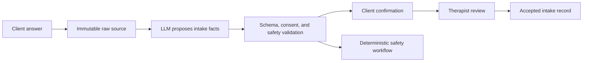

# Corvus

Corvus is an expedited, clinician-reviewed therapy intake system.

It helps an adult client tell their story before the first appointment, turns that story into a structured and source-linked intake draft, and gives the therapist a fast way to correct and accept it. The goal is simple: spend less of the first session reconstructing history and more of it understanding the client and beginning useful work.

The product is a tool for therapists. It is not an AI therapist, diagnostic system, treatment recommender, or crisis counselor.

## Status

**Synthetic product demo.** The repository now contains an end-to-end browser journey from an AI disclosure to a client-reviewed manifest, deterministic therapist eligibility matching, and an approved therapist handoff. The demo uses fixed synthetic data and in-memory state. Authentication, persistence, real consent records, therapist directory verification, safety operations, and production data protections are not implemented. Corvus is not ready to receive real client information.

The implemented slice demonstrates these invariants:

- every proposed intake fact retains the source text it came from;
- the client can edit, approve, or withhold each proposal;
- matching uses explicit eligibility rules and explains every included therapist;
- only approved facts appear in the handoff; and
- the product labels itself as intake—not therapy, diagnosis, or treatment advice.

## Run the demo

```bash
pnpm install
pnpm dev
```

Open `http://localhost:3000`. Run `pnpm test` for the domain workflow, `pnpm test:e2e` for the browser journey, and `pnpm build` for the production build check.

## The problem

Therapy intake usually forces a bad tradeoff:

- A fixed form is efficient but often strips away context.
- An open-ended conversation preserves context but consumes scarce session and documentation time.
- A generated summary can be fast but is unsafe if nobody can tell which statements came from the client, which were inferred, or which were invented.

Corvus combines the useful parts of forms and conversation. The client can answer naturally, the system compiles their answers into a reviewable structure, and the therapist remains responsible for the clinical record and every clinical decision.

## Who it is for

The first customer is an independent outpatient therapist or small therapy practice working with adult clients.

The therapist's promise is:

> Receive a useful, source-linked intake draft before the first session without surrendering clinical judgment.

The client's promise is:

> Tell your story once, see what the system understood, correct it, and decide what reaches your therapist.

## The first complete workflow

1. **The therapist configures an intake.** The practice selects its required fields, approved measures, consent language, safety procedure, and optional follow-up questions.
2. **The client receives a secure invitation.** Before answering, the client sees who will receive the information, why it is being collected, how long it will be retained, and how to stop.
3. **The client completes a guided intake.** They can use a mixture of structured fields and natural-language answers. Required questions stay explicit. The system does not hide a clinical assessment inside an unbounded chat.
4. **The system proposes structured evidence.** A language model extracts client-reported facts, goals, history, strengths, preferences, uncertainties, and possible contradictions. Every proposal retains its exact source passage.
5. **Rules validate and route the proposals.** Deterministic code checks the schema, dates, negation, required fields, consent, unsupported claims, and safety terms. Safety routing does not depend on a probabilistic personal-state score.
6. **The client reviews sensitive interpretations.** The client can confirm, edit, reject, or withhold proposed information before submission.
7. **The therapist reviews the draft.** The therapist sees the concise intake, its sources, missing information, contradictions, client corrections, and any safety item requiring attention. Nothing becomes clinician-accepted merely because the model produced it.
8. **The accepted record is exported or retained.** The therapist can copy or export the accepted draft into the practice's record workflow. The original evidence and correction history remain auditable according to the practice's retention policy.



## How information is parsed

The language model is a noisy parser, not the source of truth. It may propose a record like this:

```ts
interface IntakeFactProposal {
  sourceId: string;
  sourceSpan: string;
  assertedBy: "client" | "clinician" | "document";
  topic:
    | "presenting_concern"
    | "goal"
    | "reported_symptom"
    | "life_event"
    | "relationship"
    | "treatment_history"
    | "medication_history"
    | "risk_statement"
    | "strength"
    | "preference";
  value: unknown;
  timeRange?: { start?: string; end?: string };
  negated: boolean;
  extractionConfidence: number;
  sensitive: boolean;
  status: "proposed" | "client_confirmed" | "corrected" | "rejected";
  extractorId: string;
}
```

Suppose a client writes:

> Since moving in June, I have slept about five hours most nights. I want to make friends, but I cancel plans because I am exhausted, not because I am afraid.

The parser may propose:

- a move in June;
- client-reported sleep of about five hours on most nights;
- a goal of making friends;
- a pattern of cancelling plans;
- the client's explanation that exhaustion contributes to cancellation; and
- an explicit negation of fear as the explanation.

Those are source-linked proposals. The system must not silently turn that passage into a diagnosis, infer another person's intent, or manufacture scores such as `avoidance = 22`.

### Where each kind of information goes

| Information | Destination | Authority |
| --- | --- | --- |
| Client narrative and history | Evidence ledger and draft intake | Client reports; therapist accepts or edits |
| Required demographic or practice fields | Structured intake record | Client enters; validation checks format |
| Validated questionnaire responses | Measure record with instrument and scoring lineage | Deterministic scoring rules |
| Missing or contradictory information | Therapist review queue or approved follow-up question | Rules select eligibility; client answers |
| Possible urgent safety language | Separate safety workflow | Practice protocol and accountable human |
| Diagnosis, formulation, and treatment plan | Outside model authority | Therapist only |

Corrections are new events. They do not erase the fact that an earlier draft existed, and regenerated summaries never rewrite an already accepted record without review.

## What is actually intelligent

The first useful product has four forms of narrowly bounded intelligence:

1. **Narrative compilation.** Convert natural language into typed, source-linked proposals.
2. **Coverage checking.** Identify required fields that remain unanswered and contradictions that need review.
3. **Bounded question selection.** Choose the next eligible question from a practice-approved bank, including the option to ask nothing. The model does not invent unrestricted clinical probes.
4. **Draft generation.** Render accepted evidence into a concise therapist-facing intake while preserving uncertainty and provenance.

This is intentionally semi-deterministic. A fixed intake form remains the baseline and the fallback. The product is better than a scorecard only if narrative input captures useful context, reduces work, or improves coverage without adding unacceptable errors or burden.

No model retrains itself after a client conversation. The extractor, prompt, schema, and question policy are pinned for a release. Improvements are evaluated offline against purpose-built, appropriately governed clinician-reviewed examples and are deployed only after they beat the shipped behavior. Client intake data is not used to train models.

## Where the Kalman filter belongs

It does not belong in the initial intake path.

A Kalman filter is useful when the same uncertain quantity is measured repeatedly over time. A one-time intake contains history and narrative, not a trustworthy sequence of comparable measurements. Applying a state filter to it would create mathematical theater.

If Corvus later supports between-session monitoring, a small state-space model may help distinguish a changing client-reported trajectory from measurement noise. For a roughly continuous repeated measure, the update can be as simple as:

```text
predicted variance = previous variance + elapsed time × expected volatility
Kalman gain       = predicted variance / (predicted variance + source error)
updated state     = prediction + Kalman gain × (new measure - prediction)
```

That would provide memory, elapsed-time dynamics, source reliability, and explicit uncertainty. It would still not parse language, diagnose a client, establish causality, or choose treatment.

Any later longitudinal model must begin with one directly measured outcome and compete prospectively against:

- the latest response;
- the client's historical mean;
- a moving average;
- a simple trend; and
- the therapist's existing view when it can be measured responsibly.

Only a limited personal baseline, volatility, persistence, or source reliability may adapt at first. Sparse clients remain close to population defaults. If the state model does not materially improve prediction or therapist decisions, it is removed and the simpler display ships.

## What the therapist receives

The default output is a short review workspace, not an authoritative psychological profile. It contains:

- the client's stated reason for seeking therapy;
- goals in the client's own language;
- relevant client-reported history and current context;
- strengths, supports, preferences, and concerns;
- completed measures with their provenance;
- missing required information;
- contradictions or ambiguous dates worth clarifying;
- client corrections and withheld items;
- safety items routed under the practice's protocol; and
- links from every summarized claim to its source.

The therapist can accept, edit, reject, or defer every section. The product should make uncertainty visible and abstain when the evidence does not support a useful draft.

## How we know it is valuable

Shipping software and showing an attractive summary do not establish value. The product earns its place if it gets therapists to an accepted intake faster without reducing information quality, increasing client burden, or creating safety failures.

The first comparison is Corvus versus the practice's existing form and documentation workflow. Measure:

| Outcome | What it answers |
| --- | --- |
| Therapist minutes from submission to accepted intake | Does it actually save work? |
| First-session time spent reconstructing basic history | Does it create more usable session time? |
| Required-field and clinician-rated information coverage | Is the draft complete enough to use? |
| Proposal acceptance, correction, rejection, and unsupported-claim rates | Is the parser trustworthy? |
| Client completion time, abandonment, and burden | Is efficiency being purchased at the client's expense? |
| Safety-route false negatives, false positives, and response time | Does the operational protocol behave as specified? |
| Privacy regret, withholding, deletion, and support requests | Do clients retain meaningful control? |

The extraction layer is evaluated separately from the whole product. It must be tested on held-out, clinician-reviewed examples by topic, negation, temporal accuracy, source-span correctness, and subgroup. A better whole-product outcome does not prove every extracted field is correct; a good extraction benchmark does not prove therapists save time.

The kill rule is straightforward: if therapists do not reach an acceptable record faster, or if any time savings require more unsupported claims, more client burden, or weaker safety, simplify or stop the product rather than adding more ML.

## Safety and clinical boundary

- Corvus does not diagnose, formulate, recommend treatment, or represent itself as therapy.
- It does not infer another person's beliefs, intentions, reciprocity, attachment, or worth.
- It does not autonomously contact a client, family member, clinician, or emergency service.
- Possible high-risk language enters a separately specified deterministic workflow with an accountable human; a generative summary or Kalman estimate is never the safety mechanism.
- The client controls submission of sensitive proposed facts except where the practice's disclosed legal and safety obligations require otherwise.
- The system does not optimize conversation length, attachment to the AI, or engagement.
- Raw sources, model proposals, client corrections, therapist decisions, exports, access, and deletion events are auditable.

When Corvus hosts or accesses protected health information on behalf of a covered provider, it may be a business associate and the provider may need a business associate agreement before that access. HHS specifically identifies hosted patient-information software and some provider-contracted health apps as examples. See the [HHS software-vendor FAQ](https://www.hhs.gov/hipaa/for-professionals/faq/256/is-software-vendor-business-associate/index.html) and [HHS business-associate guidance](https://www.hhs.gov/hipaa/for-professionals/privacy/guidance/business-associates/index.html).

Product claims and intended use must also be reviewed against current law and the FDA's [Clinical Decision Support Software guidance](https://www.fda.gov/regulatory-information/search-fda-guidance-documents/clinical-decision-support-software). The design goal is clinician-reviewed intake documentation, not an opaque diagnostic or treatment decision.

## System boundaries

The production system has seven modules:

1. **Client intake portal** — invitation, consent, structured questions, narrative answers, review, and submission.
2. **Therapist workspace** — practice templates, client queue, source-linked draft review, acceptance, and export.
3. **Evidence ledger** — append-only raw sources, proposals, corrections, consent, and provenance.
4. **Observation adapter** — typed language-model extraction behind validation and failure handling.
5. **Question engine** — required-field rules and bounded selection from approved questions.
6. **Safety router** — deterministic practice-configured detection, acknowledgement, escalation, and audit workflow.
7. **Operations layer** — tenant isolation, access control, encryption, audit logs, retention, export, deletion, monitoring, backup, and incident response.

The minimum durable records are:

- `Practice`, `Clinician`, `Client`, and `Invitation`;
- `ConsentEvent` and `DisclosurePolicy`;
- `RawIntakeSource`;
- `IntakeFactProposal` and `FactRevision`;
- `MeasureDefinition` and `MeasureResponse`;
- `QuestionDecision` and `ClientAnswer`;
- `SafetyReview`;
- `IntakeDraft` and `ClinicianDecision`;
- `ExportEvent`, `AccessEvent`, `DeletionRequest`, and `AuditEvent`; and
- `ExtractorArtifact`, `PromptArtifact`, and schema lineage.

Model and schema lineage still require machine-readable identifiers even though this README is the single current product explanation. That is an audit requirement, not a sequence of speculative product versions.

## What exists now

A working web application has already established several reusable seams: authenticated participant ownership, source-specific consent events, append-only check-ins, immutable derived snapshots, bounded outputs, feedback capture, deterministic domain tests, and a credential-free fallback demonstration.

That application is a technical starting point, not a therapy-intake product and not ready to receive clinical data. The current state updater is a fixed six-dimension Kalman-style scorecard with hand-selected parameters. It has no learned population model or personal parameter training and should not be presented as adaptive ML.

The intake product still needs:

- practice and clinician tenancy;
- the client invitation and consent flow;
- the intake domain model and practice-configurable template;
- structured extraction with source spans and correction;
- the client confirmation and therapist review workspaces;
- the deterministic safety protocol;
- accepted-draft export and record locking;
- privacy, security, vendor, and legal review for the intended data and claims; and
- production monitoring, backup, restore, retention, access review, incident response, and deletion exercises.

Existing infrastructure vendors must be re-evaluated for the therapy workflow, required agreements, data use, retention, regional processing, access controls, backup, and deletion before any real client information is accepted.

## Build order

1. Define one outpatient adult-intake template with practicing therapists, including required fields, approved measures, safety workflow, and the exact accepted output.
2. Build the client invitation, consent, fixed-form completion, therapist review, and export tracer without an LLM. This is the operational baseline.
3. Add natural-language answers and source-linked extraction behind the same intake contract.
4. Add client confirmation, contradiction handling, bounded follow-up questions, and explicit abstention.
5. Complete tenant isolation, audit, retention, export, deletion, monitoring, backup, restore, incident response, vendor agreements, and legal review.
6. Run the workflow with a small set of partner therapists, compare it with their existing intake process, and remove anything that does not save time or improve usable coverage.
7. Add EHR integration only after the accepted record and correction semantics are stable.
8. Consider longitudinal measures and a state filter only after expedited intake works as a standalone product.

Wearables, passive sensing, relationship graphs, autonomous recommendations, reinforcement learning, and a general model of a person are outside the first product.

## Production-ready means

Corvus is ready for live client use only when:

- a therapist can configure, invite, review, accept, and export an intake end to end;
- a client can understand consent, complete the intake, inspect sensitive proposals, correct them, submit them, and exercise access and deletion rights;
- every accepted statement is traceable to client-entered data, a scored measure, an attached document, or a therapist edit;
- unsupported model text cannot enter the accepted record;
- practice and client data are isolated on every server-side operation;
- safety events follow the declared workflow and are tested with drills;
- raw data and subprocessors are limited to the declared purpose;
- required agreements, privacy notices, security controls, retention schedules, and incident procedures are in force;
- failures degrade to the fixed form and manual review rather than losing or fabricating information;
- backup, restore, export, deletion, monitoring, alerting, and rollback have been exercised; and
- the build, tests, authorization checks, extraction evaluation, and primary end-to-end journey pass in a production-like environment.

## Repository map

- [`docs/decisions/`](docs/decisions/) records durable architectural and scientific decisions.
- [`docs/research/`](docs/research/) contains the primary-source evidence base and comparable-system reviews.
- [`docs/specs/`](docs/specs/) contains earlier design work and historical model proposals. When it conflicts with this README's product scope, this README describes the current product direction until a new durable decision is recorded.
- [`AGENTS.md`](AGENTS.md) defines the working and scientific guardrails for contributors and coding agents.
- [`src/domain/intake-workflow.ts`](src/domain/intake-workflow.ts) contains the deterministic demo workflow.
- [`src/components/corvus-demo.tsx`](src/components/corvus-demo.tsx) contains the interactive browser journey.

## Claim discipline

Material claims use these meanings:

- **Hypothesis** — plausible but not operationally demonstrated.
- **Specified** — the construct, workflow, and acceptance criteria are defined.
- **Simulated** — behavior has been tested on synthetic or replayed data.
- **Observed** — prospectively observed in real use under stated conditions.
- **Causally supported** — supported by a design that identifies a causal effect under stated assumptions.

Today, the therapy-intake product direction is **specified**. Its usefulness, safety in live practice, extraction performance, and time savings are not yet observed or causally supported.

## License

No license has been selected. Until one is added, all rights are reserved.
