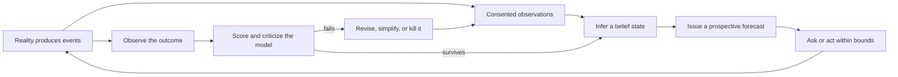

# Foundational modeling and criticism for Osanwe

Last reviewed: 2026-08-25

## Research question

How should Osanwe build a participant-owned longitudinal model from narrative, self-report, wearable, context, and action data when the model is necessarily wrong, the state is only partially observed, and the system must remain scientifically useful?

This note distinguishes:

- **Foundational result:** a result established in the cited statistical, machine-learning, or control literature.
- **Modern result:** a later empirical or methodological result that sharpens the foundation.
- **Osanwe implication:** a proposed product decision. It is an extrapolation until Osanwe validates it prospectively.

## Answer in one sentence

Osanwe should not claim to recover a person's true inner state; it should maintain a revisable probability distribution over explicitly defined latent constructs, use that distribution to make preregistered forecasts of observable outcomes, and retain a model only while those forecasts remain calibrated, beat simple baselines, and support low-risk decisions.

The governing loop is criticism, not confidence:



George Box's original argument was not permission to use an arbitrary approximation. It was that scientific learning alternates between conjecture and criticism, and that a model must be checked for consequential discrepancies. Box later made the split explicit: posterior estimation answers questions *inside* a model, while predictive checking criticizes the model itself ([Box 1976](https://doi.org/10.1080/01621459.1976.10480949); [Box 1980](https://academic.oup.com/jrsssa/article/143/4/383/7105478)).

## 1. The formal object

### 1.1 State, observations, actions, and parameters

For a participant at time \(t\), define:

- \(z_t \in \mathbb{R}^K\): a latent state over named, operational constructs;
- \(y_t^{(m)}\): an observation from modality \(m\), such as self-report, narrative extraction, or wearable measurement;
- \(c_t\): observed context;
- \(a_t\): a system-suggested or participant-chosen action;
- \(r_t^{(m)}\): whether modality \(m\) was observed;
- \(\theta\): population and participant parameters;
- \(M\): the model specification and version.

A controlled state-space model factors into transition, observation, and missingness models:

\[
z_t \sim p_\theta(z_t \mid z_{t-1}, a_{t-1}, c_t, M)
\]

\[
y_t^{(m)} \sim p_{\theta_m}(y_t^{(m)} \mid z_t, c_t, M)
\]

\[
r_t^{(m)} \sim p_{\phi_m}(r_t^{(m)} \mid z_t, c_t, \text{burden}_t, M).
\]

The missingness term matters because silence is not automatically neutral: someone may skip a check-in because they are busy, well, distressed, disengaged, or simply not prompted. Treating all missingness as random can manufacture state changes.

The online belief state is a distribution, not a label:

\[
b_t(z_t,\theta)
=p(z_t,\theta \mid y_{1:t},r_{1:t},a_{1:t-1},c_{1:t},M).
\]

Its recursive update is:

\[
b_t \propto
p(y_t,r_t \mid z_t,c_t,\theta,M)
\int p(z_t \mid z_{t-1},a_{t-1},c_t,\theta,M)b_{t-1}\,dz_{t-1}.
\]

This is the general Bayesian-filtering pattern. Kalman's original linear-Gaussian construction propagates a state estimate and its error covariance recursively, rather than recomputing the entire history ([Kalman 1960](https://doi.org/10.1115/1.3662552)). Gordon, Salmond, and Smith later represented nonlinear or non-Gaussian filtering distributions with particles, at additional approximation and computational cost ([Gordon, Salmond, and Smith 1993](https://doi.org/10.1049/ip-f-2.1993.0015)).

### 1.2 Estimation is not training

This distinction is non-negotiable:

- **State inference:** updating \(b_t(z_t)\) as new observations arrive while \(\theta\) is fixed.
- **Parameter learning:** estimating transition rates, observation reliability, person-level deviations, or effects in \(\theta\) from data.
- **Model selection:** choosing the state dimension, factorization, noise family, or competing model \(M\).
- **Policy learning:** estimating which action helps, for whom, and when.

A Kalman-style update with hand-chosen matrices is a state estimator, not an empirically trained psychological ML model. It can power a transparent simulation, but it must be labeled **specified** or **simulated**, not **learned** or **validated**. System identification treats model structure, experiment design, parameter estimation, and validation as separate operations; informative inputs and residual validation are part of learning a dynamic system, not optional cleanup ([Ljung 1999](https://www.rt.isy.liu.se/en/books/sysid/)).

### 1.3 Belief state is not brain state

Hidden Markov models formalize observations that are probabilistic functions of an unobserved Markov state ([Baum and Petrie 1966](https://doi.org/10.1214/aoms/1177699147)). POMDP theory then shows that, under a specified generative model, the posterior distribution over hidden states can summarize the action-observation history for decision-making ([Smallwood and Sondik 1973](https://doi.org/10.1287/opre.21.5.1071)).

**Osanwe implication:** borrow the *belief-state separation*, not the metaphysical claim. `BeliefState` should mean “what this versioned model currently assigns probability to,” never “what is actually inside this person's head.” The participant remains authoritative about meaning and goals.

## 2. What model family earns the first attempt?

### 2.1 Start with the smallest dynamic model that can fail clearly

A defensible first model is a low-dimensional hierarchical dynamic linear model:

\[
z_{i,t}=\mu_i+A(z_{i,t-1}-\mu_i)+Ba_{i,t-1}+Cc_{i,t}+\epsilon_{i,t},
\qquad \epsilon_{i,t}\sim\mathcal N(0,Q),
\]

with modality-specific observation equations, for example:

\[
y_{i,t}^{(m)}=\alpha_m+H_mz_{i,t}+D_mc_{i,t}+\nu_{i,t}^{(m)}.
\]

Ordinal self-reports need ordinal likelihoods; counts need count likelihoods; robust continuous observations may need Student-\(t\) noise. The linear-Gaussian version is a baseline and debugging oracle, not a declaration that psychology is linear or Gaussian. West and Harrison develop dynamic Bayesian models precisely as sequential forecasting models in changing environments ([West and Harrison 1997](https://doi.org/10.1007/b98971)).

Hierarchical partial pooling can estimate population regularities while shrinking person-specific parameters toward the population when individual data are sparse. Osanwe should initially learn only a small set of interpretable personal deviations—such as baseline, volatility, and modality reliability—not a full personal transition matrix.

### 2.2 Complexity ladder

| Level | Candidate | It earns promotion only if… |
|---|---|---|
| 0 | Last observation, moving average, time-of-day/week, and self-report-only rules | Every learned model must beat these prospectively. |
| 1 | Hierarchical linear-Gaussian state-space model | It is identifiable, calibrated, and improves forecast score. |
| 2 | Robust/ordinal/count observation models; irregular elapsed-time transitions | Residual checks show the simpler likelihood or clock is wrong. |
| 3 | Time-varying parameters or change-point process | Predeclared drift tests show persistent rather than transient failure. |
| 4 | Switching/HMM or nonlinear particle model | Predictive distributions are demonstrably multimodal or regime-based and the gain survives prospective testing. |
| 5 | Neural residual or representation | It adds replicated predictive value after the structured model and preserves auditability, calibration, and safe abstention. |

Akaike's original model-identification result frames model choice as estimated predictive information loss with an explicit complexity penalty, rather than selecting the richest model that can fit the sample ([Akaike 1974](https://doi.org/10.1109/TAC.1974.1100705)). Breiman's later critique is also relevant: conclusions derived from an assumed data mechanism are conclusions about that model unless the mechanism survives empirical challenge; predictive performance and interpretability answer different questions ([Breiman 2001](https://doi.org/10.1214/ss/1009213726)).

## 3. Identifiability before interpretation

Rothenberg formalized identifiability as whether distinct parameter values induce distinguishable observable distributions; under regularity conditions, local identifiability relates to a nonsingular information matrix ([Rothenberg 1971](https://doi.org/10.2307/1913267)).

For a linear latent model, any invertible transform \(T\) can produce:

\[
z'_t=Tz_t,\qquad A'=TAT^{-1},\qquad H'=HT^{-1},
\]

with the same observable distribution. Without anchors, names such as “belonging” or “receptivity” can therefore be arbitrary rotations, signs, or scales of a latent space.

Osanwe must distinguish three problems:

1. **Structural identifiability:** Could infinite perfect observations distinguish the parameters or constructs?
2. **Practical identifiability:** Does the available sparse, noisy record constrain them enough to matter?
3. **Causal identifiability:** Can an observed post-action change be attributed to the action rather than context, selection, expectations, or regression to the mean?

Required consequences:

- Anchor every named construct to preregistered participant-reported measures and observable outcomes.
- Fix scale and orientation in the measurement model; test longitudinal measurement invariance.
- Run parameter-recovery simulations before interpreting fitted parameters.
- Report posterior dependence and effective information, not only point estimates.
- Do not jointly learn a large state, transition matrix, sensor reliabilities, and action effects from one person's short history.
- Never infer action effects from “recommendation followed, then outcome improved” alone; the recommendation policy selected the occasion.

## 4. Prediction is the empirical contact point

### 4.1 Prequential evaluation

Dawid's prequential principle evaluates a model by the sequence of probability forecasts it issues before each outcome, using only information then available ([Dawid 1984](https://doi.org/10.2307/2981683)). That is Osanwe's cleanest defense against retrospective storytelling.

For each forecast, persist an immutable record:

```text
issued_at
target and horizon
predictive distribution or quantiles
available evidence cutoff
model and parameter version
policy/action context
later observed outcome and observation quality
```

Do not regenerate yesterday's forecast using today's corrected state. Corrections may produce a new counterfactual replay, but the original forecast remains the scientific record.

### 4.2 Proper scores and calibration

Brier introduced squared-error verification for probability forecasts ([Brier 1950](https://doi.org/10.1175/1520-0493%281950%29078%3C0001%3AVOFEIT%3E2.0.CO%3B2)). For a binary event:

\[
\operatorname{BS}=\frac{1}{N}\sum_{j=1}^{N}(p_j-y_j)^2.
\]

For a realized outcome \(y\), the logarithmic loss is:

\[
\operatorname{LogLoss}=-\log p(y).
\]

Strictly proper scoring rules make the expected score optimal when the forecast reports its actual predictive distribution. Gneiting and Raftery characterize the forecasting goal as maximizing sharpness subject to calibration: narrow forecasts are valuable only when their stated probabilities remain statistically consistent with outcomes ([Gneiting and Raftery 2007](https://doi.org/10.1198/016214506000001437)).

Osanwe should report, by target, horizon, participant phase, and modality availability:

- log score and an outcome-appropriate proper score;
- calibration curves for event probabilities;
- empirical coverage and width of 50%, 80%, and 95% predictive intervals;
- score relative to every Level-0 baseline;
- abstention rate and error conditional on abstention/not-abstention;
- performance before and after user corrections;
- subgroup results only where sample size and consent allow responsible interpretation.

Aggregate accuracy alone is insufficient. A model can be accurate because the outcome is stable, overconfident exactly when wrong, or useful for one phase of a person's life and harmful in another.

## 5. Model criticism is a first-class runtime

Posterior inference is conditional on the model. Posterior predictive checking asks whether replicated data generated by the fitted model resemble the observed data on discrepancies that matter ([Gelman, Meng, and Stern 1996](https://www3.stat.sinica.edu.tw/statistica/j6n4/j6n41/j6n41.htm)). Modern Bayesian workflow treats model construction, computation, checking, comparison, and revision as an iterative whole ([Gelman et al. 2020](https://arxiv.org/abs/2011.01808)).

Osanwe needs four different validation layers:

### A. Mathematical and implementation validity

- Unit-test filtering against analytically solvable linear-Gaussian cases.
- Generate parameters, data, and posteriors to run simulation-based calibration; uniform rank failures reveal implementation or inference error ([Cook, Gelman, and Rubin 2006](https://doi.org/10.1198/106186006X136976); [Talts et al. 2018](https://arxiv.org/abs/1804.06788)).
- Run parameter-recovery grids across sample size, missingness, noise, and outlier regimes.
- Assert covariance positivity, normalized probabilities, deterministic replay under a fixed seed, and stable handling of zero observations.

### B. Model adequacy

- Prior predictive check: do priors generate plausible trajectories, dwell times, and observation ranges?
- Posterior predictive check: can fitted simulations reproduce volatility, autocorrelation, cross-modal disagreement, missing streaks, extreme events, and correction frequency?
- Innovation check: one-step residuals should not retain predictable trend, seasonality, or autocorrelation the model claims to represent.
- Sensitivity check: vary priors, likelihood tails, lag lengths, and missingness assumptions.
- Negative controls: irrelevant or time-shuffled features should not improve forecasts.

### C. Prospective usefulness

- Freeze the model before the evaluation window.
- Score every prediction made, not a curated subset.
- Compare against naive, self-report-only, wearable-only, and LLM-only baselines.
- Ablate each modality and report incremental value, not merely full-model performance.
- Evaluate a decision outcome separately from state reconstruction.

### D. Model failure and abstention

- Detect out-of-support inputs, device changes, long gaps, contradictory evidence, and sudden calibration loss.
- Widen uncertainty or abstain rather than silently extrapolate.
- Preserve enough context to explain *why* the model abstained without inventing a psychological reason.
- Define reversal and kill criteria before seeing results.

## 6. Nonstationarity is two different phenomena

Dynamic state and model drift must not be conflated:

- **State change:** the person changed within a still-useful transition and observation model. This belongs in \(z_t\) and process noise \(Q\).
- **Mechanism change:** the relationship between state, sensors, context, and outcomes changed. This is shift in \(\theta\) or \(M\).

Dataset shift means the deployment joint distribution differs from the development distribution; ordinary validation may no longer estimate deployment risk ([Quiñonero-Candela et al. 2008](https://doi.org/10.7551/mitpress/9780262170055.001.0001)). Even when only covariates change, ordinary cross-validation can become biased, motivating target-distribution-aware evaluation ([Sugiyama, Krauledat, and Müller 2007](https://jmlr.org/papers/v8/sugiyama07a.html)). A large modern benchmark found that uncertainty quality and post-hoc calibration often degrade under increasing dataset shift ([Ovadia et al. 2019](https://proceedings.neurips.cc/paper_files/paper/2019/hash/8558cb408c1d76621371888657d2eb1d-Abstract.html)).

Osanwe should track change in:

- device, firmware, vendor algorithm, and wearing behavior;
- season, travel, illness, schedule, or life phase;
- check-in wording and LLM extractor version;
- who chooses to answer and when;
- intervention exposure and habituation;
- the participant's own definitions and goals.

A sliding recalibration window is not automatically a solution: it can mistake a durable life change for noise or erase rare but important history. Drift detection should trigger a model review, version boundary, wider uncertainty, or re-anchoring—not invisible self-modification.

## 7. Asking questions and trying actions are different experiments

Lindley defined the information in an experiment as the expected change from prior to posterior knowledge ([Lindley 1956](https://doi.org/10.1214/aoms/1177728069)). In current notation, the expected information gain from a candidate measurement \(q\) is:

\[
\operatorname{EIG}(q)
=\mathbb E_{y\sim p(y\mid q,D)}
\left[
\operatorname{KL}
\left(
p(\theta,z\mid D,y,q)
\;\|\;
p(\theta,z\mid D)
\right)
\right].
\]

For Osanwe, the utility of a question must include burden and consent:

\[
U(q)=\operatorname{EIG}_{\text{decision-relevant}}(q)
-\lambda_b\operatorname{Burden}(q)
-\lambda_s\operatorname{Sensitivity}(q).
\]

**Osanwe implication:** optimize information about a declared forecast or choice, not total curiosity about the participant. Questions come from a reviewed finite set, include “ask nothing,” and obey daily burden budgets.

An action recommendation is not just another observation query: it may change the state, future observations, and what data become available. Action-effect learning therefore requires logged eligibility, action alternatives, selection probability, adherence, and proximal outcome. Until a randomized or otherwise causally identified design exists, Osanwe may forecast associations and invite optional experiments, but must not claim personalized treatment effects.

## 8. The LLM boundary

The LLM can make heterogeneous language usable, but its output enters through an observation model:


Required boundaries:

- Preserve source spans, extractor version, prompt version, and correction history.
- Calibrate extraction reliability against human-coded observations; model-reported confidence is not evidence of calibration.
- Keep missing, contradicted, and ambiguous evidence distinct from negative evidence.
- Never let generated prose write directly to latent state or action value.
- Evaluate extraction, state forecasting, and intervention policy as separate systems.

This separation also limits the feedback-loop and data-dependency failures documented in production ML systems ([Sculley et al. 2015](https://proceedings.neurips.cc/paper/2015/hash/86df7dcfd896fcaf2674f757a2463eba-Abstract.html)).

## 9. Falsifiable claims and kill tests

| Claim | Test | Failure condition |
|---|---|---|
| The state-space model captures useful temporal information. | Prospective proper-score comparison with last-value and moving-average baselines. | No stable lift across preregistered windows. |
| A named latent construct is measurable. | Anchor loading, recovery simulation, invariance, and posterior concentration. | Rotations/priors dominate or anchors do not agree. |
| Narrative adds information. | Narrative ablation and time-shuffled negative control. | No lift, leakage, or gains disappear after correction auditing. |
| Wearables add information beyond self-report and context. | Wearable ablation by forecast horizon and device phase. | No incremental lift or performance depends on undocumented vendor changes. |
| Uncertainty is meaningful. | Coverage, probability calibration, and shift stress tests. | Systematic undercoverage, especially in high-burden or shifted periods. |
| Personalization is learned rather than memorized noise. | Hierarchical model versus population-only model on future windows. | Personal parameters do not improve score or are practically unidentified. |
| A question is worth asking. | Randomized question/no-question comparison of information gain, burden, and downstream score. | No useful uncertainty reduction or burden outweighs value. |
| A recommended experiment helps. | Preregistered randomized or otherwise causally identified comparison. | No benefit, heterogeneous harm, unacceptable burden, or dependence increases. |

No single passed check “validates the model.” Different checks attack computation, measurement, prediction, shift, and causal use. A failed high-consequence check blocks the associated claim even if another metric improves.

## 10. Architecture implications

1. **Persist beliefs, evidence, and forecasts as different objects.** Store an immutable observation ledger with provenance, versioned model specifications and parameters, derived posterior snapshots, and immutable prospective forecasts. Never overwrite the scientific record when the participant corrects evidence.
2. **Implement three seams, not one magic model.** `ObservationModel` maps each modality to likelihood evidence; `StateEstimator` performs transition and Bayesian update; `DecisionPolicy` maps belief plus constraints to ask/act/abstain. The LLM sits outside all three.
3. **Ship a reference estimator before a research estimator.** The first executable core should be a small linear-Gaussian or conjugate model with exact replay and known-answer tests. A more flexible model must beat it on prospective score and calibration before promotion.
4. **Make model criticism a production subsystem.** Proper scores, interval coverage, residual checks, shift flags, ablations, and abstention behavior need versioned event data and dashboards; they cannot be reconstructed reliably after the pitch or study.
5. **Keep information gathering separate from causal action learning.** Expected information gain may choose an optional question. It cannot establish that an intervention helps. Action learning begins only with an explicit causal protocol and logged randomization or assignment probability.

## 11. What is foundational versus proposed

| Statement | Status |
|---|---|
| Recursive probability distributions can estimate hidden dynamic state from noisy observations. | **Foundational result.** |
| A belief distribution can summarize history for control under a correct POMDP specification. | **Foundational result, conditional on the model.** |
| Probability forecasts should be judged prospectively with proper scores and calibration. | **Foundational result.** |
| Predictive simulation can expose ways a fitted Bayesian model fails to reproduce relevant data features. | **Foundational result.** |
| Informative experiments can be selected by expected information gain. | **Foundational result.** |
| Six proposed social-flourishing dimensions correspond to real, separable psychological state variables. | **Osanwe hypothesis.** |
| Narrative and wearable data jointly improve an individual's forecast. | **Osanwe hypothesis.** |
| Better forecasts enable beneficial personal experiments. | **Osanwe hypothesis requiring causal validation.** |
| A hierarchical dynamic model is the right first implementation. | **Osanwe design proposal, chosen for legibility and falsifiability.** |

## 12. The first scientifically honest tracer bullet

The pitch implementation should demonstrate a *specified inference loop*, not imply completed empirical training:

1. Replay a synthetic, versioned sequence of wearable, self-report, context, and narrative observations.
2. Show exactly how each modality's likelihood moves a posterior and how disagreement widens or redistributes uncertainty.
3. Freeze and store a forecast for a narrow observable target.
4. Reveal the simulated outcome and score the forecast against naive baselines.
5. Correct one source observation and replay the derived posterior without altering the original evidence or forecast.
6. Trigger an out-of-support case and visibly abstain.

That is a credible two-minute demonstration of the research machinery. “The model has learned this person” is not credible until parameter learning and prospective evaluation have actually occurred.

## Primary sources

- Akaike, H. (1974). [A new look at the statistical model identification](https://doi.org/10.1109/TAC.1974.1100705). *IEEE Transactions on Automatic Control*, 19(6), 716–723.
- Baum, L. E., & Petrie, T. (1966). [Statistical inference for probabilistic functions of finite state Markov chains](https://doi.org/10.1214/aoms/1177699147). *Annals of Mathematical Statistics*, 37(6), 1554–1563.
- Box, G. E. P. (1976). [Science and statistics](https://doi.org/10.1080/01621459.1976.10480949). *Journal of the American Statistical Association*, 71(356), 791–799.
- Box, G. E. P. (1980). [Sampling and Bayes' inference in scientific modelling and robustness](https://academic.oup.com/jrsssa/article/143/4/383/7105478). *Journal of the Royal Statistical Society A*, 143(4), 383–430.
- Breiman, L. (2001). [Statistical modeling: The two cultures](https://doi.org/10.1214/ss/1009213726). *Statistical Science*, 16(3), 199–231.
- Brier, G. W. (1950). [Verification of forecasts expressed in terms of probability](https://doi.org/10.1175/1520-0493%281950%29078%3C0001%3AVOFEIT%3E2.0.CO%3B2). *Monthly Weather Review*, 78(1), 1–3.
- Cook, S. R., Gelman, A., & Rubin, D. B. (2006). [Validation of software for Bayesian models using posterior quantiles](https://doi.org/10.1198/106186006X136976). *Journal of Computational and Graphical Statistics*, 15(3), 675–692.
- Dawid, A. P. (1984). [Statistical theory: The prequential approach](https://doi.org/10.2307/2981683). *Journal of the Royal Statistical Society A*, 147(2), 278–292.
- Gelman, A., Meng, X.-L., & Stern, H. (1996). [Posterior predictive assessment of model fitness via realized discrepancies](https://www3.stat.sinica.edu.tw/statistica/j6n4/j6n41/j6n41.htm). *Statistica Sinica*, 6, 733–807.
- Gelman, A., et al. (2020). [Bayesian workflow](https://arxiv.org/abs/2011.01808). arXiv:2011.01808.
- Gneiting, T., & Raftery, A. E. (2007). [Strictly proper scoring rules, prediction, and estimation](https://doi.org/10.1198/016214506000001437). *Journal of the American Statistical Association*, 102(477), 359–378.
- Gordon, N. J., Salmond, D. J., & Smith, A. F. M. (1993). [Novel approach to nonlinear/non-Gaussian Bayesian state estimation](https://doi.org/10.1049/ip-f-2.1993.0015). *IEE Proceedings F*, 140(2), 107–113.
- Kalman, R. E. (1960). [A new approach to linear filtering and prediction problems](https://doi.org/10.1115/1.3662552). *Journal of Basic Engineering*, 82(1), 35–45.
- Lindley, D. V. (1956). [On a measure of the information provided by an experiment](https://doi.org/10.1214/aoms/1177728069). *Annals of Mathematical Statistics*, 27(4), 986–1005.
- Ljung, L. (1999). [System Identification: Theory for the User](https://www.rt.isy.liu.se/en/books/sysid/) (2nd ed.). Prentice Hall.
- Ovadia, Y., et al. (2019). [Can you trust your model's uncertainty? Evaluating predictive uncertainty under dataset shift](https://proceedings.neurips.cc/paper_files/paper/2019/hash/8558cb408c1d76621371888657d2eb1d-Abstract.html). *NeurIPS 32*.
- Quiñonero-Candela, J., Sugiyama, M., Schwaighofer, A., & Lawrence, N. D. (Eds.). (2008). [Dataset Shift in Machine Learning](https://doi.org/10.7551/mitpress/9780262170055.001.0001). MIT Press.
- Rothenberg, T. J. (1971). [Identification in parametric models](https://doi.org/10.2307/1913267). *Econometrica*, 39(3), 577–591.
- Sculley, D., et al. (2015). [Hidden technical debt in machine learning systems](https://proceedings.neurips.cc/paper/2015/hash/86df7dcfd896fcaf2674f757a2463eba-Abstract.html). *NeurIPS 28*.
- Smallwood, R. D., & Sondik, E. J. (1973). [The optimal control of partially observable Markov processes over a finite horizon](https://doi.org/10.1287/opre.21.5.1071). *Operations Research*, 21(5), 1071–1088.
- Sugiyama, M., Krauledat, M., & Müller, K.-R. (2007). [Covariate shift adaptation by importance weighted cross validation](https://jmlr.org/papers/v8/sugiyama07a.html). *Journal of Machine Learning Research*, 8, 985–1005.
- Talts, S., Betancourt, M., Simpson, D., Vehtari, A., & Gelman, A. (2018). [Validating Bayesian inference algorithms with simulation-based calibration](https://arxiv.org/abs/1804.06788). arXiv:1804.06788.
- West, M., & Harrison, J. (1997). [Bayesian Forecasting and Dynamic Models](https://doi.org/10.1007/b98971) (2nd ed.). Springer.
