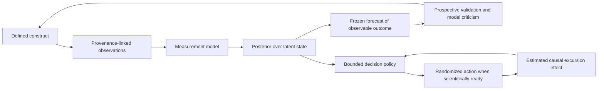

# Personalized longitudinal state estimation and intervention learning

**Status:** research synthesis, not an accepted architecture decision

**Question:** What can Osanwe rigorously estimate from repeated self-report, narrative, context, and wearable observations; how should the estimate improve; and when can the system learn which action helps?

## Executive finding

The scientifically defensible core is not a model that discovers a person's hidden psychological reality. It is a **probabilistic measurement-and-forecasting system** whose latent variables are explicitly defined hypotheses, whose observations have source-specific error models, and whose forecasts can be falsified prospectively.

The best-supported route is staged:

1. Define and validate narrow constructs and observable outcomes.
2. Collect repeated in-context measurements with provenance and burden limits.
3. Use a simple state-space model to separate a changing latent signal from measurement noise.
4. Pool population information hierarchically while allowing constrained person-level differences.
5. Evaluate frozen forecasts against simple baselines with calibration and proper scoring rules.
6. Only after measurement and forecasting work, randomize low-risk actions to identify proximal causal effects.
7. Only after randomized evidence exists, consider an adaptive policy or reinforcement learner.

This progression follows the iterative view of modeling in Box's *Science and Statistics*: useful models are deliberately simplified and must be criticized against observations, not mistaken for reality ([Box, 1976](https://doi.org/10.1080/01621459.1976.10480949)). Modern Bayesian workflow makes the same point operationally: model building includes prior predictive checks, inference diagnostics, posterior predictive checks, validation, comparison, and revision—not merely computing a posterior ([Gelman et al., 2020](https://arxiv.org/abs/2011.01808)).

## Four estimands that must not be conflated

| Target | Formal question | What success means | What it does **not** establish |
|---|---|---|---|
| Filtered state | \(p(z_t \mid y_{1:t})\) | The model coherently updates an uncertain latent state after new evidence. | That \(z_t\) is a literal property of the mind or a valid clinical construct. |
| Forecast | \(p(y_{t+h} \mid y_{1:t})\) | Frozen predictions of a prespecified future observation are calibrated and beat baselines. | Why the outcome occurs or which intervention will change it. |
| Causal excursion effect | Effect of offering action \(a_t\) rather than another option at an eligible decision time on a proximal outcome | Repeated randomization identifies an average proximal effect and prespecified moderators. | A durable or individually optimal treatment effect. |
| Individual treatment effect | Effect for this person under repeatable conditions | A randomized N-of-1 design supports a person-specific comparison. | General population efficacy or a continuously adapting policy. |

Prediction and causal explanation are separate statistical goals. Out-of-sample prediction can constrain weak psychological theories, but predictive performance alone does not identify mechanisms ([Shmueli, 2010](https://arxiv.org/abs/1101.0891); [Yarkoni & Westfall, 2017](https://pmc.ncbi.nlm.nih.gov/articles/PMC6603289/)). Longitudinal observational associations are especially vulnerable to time-varying confounding and treatment-confounder feedback ([Hernán & Robins, 2020, current online edition](https://miguelhernan.org/whatifbook)).

## Candidate methods and their proper role

### Measurement and observation

| Method | Exactly what it estimates or supplies | Data requirements | Assumptions and limitations | Osanwe stage |
|---|---|---|---|---|
| **Ecological momentary assessment (EMA)** | Repeated observations of current experience, behavior, and context in ordinary life. EMA is a sampling design, not a state estimator. | Event-contingent or scheduled prompts; electronic timestamps; repeated measures close to the moment; a declared prompting and compliance protocol. There is no universal number of prompts—the cadence must match the process timescale and the later model. | Reduces retrospective recall but does not remove self-report error, reactivity, burden, selection, or nonresponse. Prompt timing changes what is observable. ([Shiffman, Stone & Hufford, 2008](https://www.annualreviews.org/content/journals/10.1146/annurev.clinpsy.3.022806.091415)) | **Demo:** simulated check-ins. **Alpha:** real low-burden check-ins plus a weekly anchor. **Later:** adaptive prompting only after burden and missingness are characterized. |
| **Measurement-based care (MBC)** | Repeated standardized outcome measurements used collaboratively to monitor progress and inform care. It is a practice loop, not diagnosis and not an ML algorithm. | Validated measures at defined intervals, review with the person, and an action/feedback loop. | Scores must be interpreted for their intended use and alongside preferences, context, culture, and professional judgment. Osanwe can borrow the measurement discipline without claiming to deliver clinical care. ([APA MBC Guidelines, 2025](https://www.apa.org/about/policy/guidelines-measurement-based-care.pdf)) | **Demo/alpha:** borrow the visible trend, review, and correction loop. Clinical claims remain out of scope. |
| **Longitudinal latent measurement model** | Separates a latent construct from item-specific measurement error; can test whether item loadings/intercepts are comparable across people and time. | Multiple indicators for each proposed latent construct at repeated occasions; enough within-person and between-person replication for the chosen factor structure; simulation-based power analysis. | A factor is not validated because it fits. Measurement invariance and external construct evidence are needed; summed scores hide these assumptions. McNeish et al. show how measurement models can be embedded in DSEM ([McNeish et al., 2021](https://pmc.ncbi.nlm.nih.gov/articles/PMC8562472/)). | **Demo:** do not pretend six slider values validate six factors. **Alpha:** test a much smaller measurement model. **Later:** expand only if invariance and predictive value survive. |
| **Digital phenotyping / wearable sensing** | Sensor-level measurements and derived behavioral/physiological features that can serve as noisy observations or predictors. It does not directly observe a psychological construct. | Exact timestamps; device, firmware, algorithm, units, coverage, wear-time, and provenance; a prespecified transformation from raw/vendor measures to features; concurrent anchors or observable outcomes. | The inferential ladder from sensor to low-level feature to behavior to mental-health state adds uncertainty at every step. Device changes, demographic/device domain shift, privacy, dimensionality, and absent standards limit transportability. ([Mohr, Zhang & Schueller, 2017](https://pmc.ncbi.nlm.nih.gov/articles/PMC6902121/); [NIMH/Wellcome workshop report, 2024](https://pmc.ncbi.nlm.nih.gov/articles/PMC11655837/)) | **Demo:** synthetic, vendor-neutral observations. **Alpha:** baseline-relative sleep/activity/RHR/HRV features with ablation. **Later:** rawer sensor fusion only if it adds prospective value. |

The construct boundary is foundational. Cronbach and Meehl's original account treats construct validation as accumulating evidence across a nomological network, not attaching an intuitive label to a score ([Cronbach & Meehl, 1955](https://doi.org/10.1037/h0040957)). APA assessment guidance likewise ties validity to the proposed interpretation and use, favors multiple reliable sources, and requires important limitations to be communicated ([APA, 2020](https://www.apa.org/about/policy/guidelines-psychological-assessment-evaluation.pdf)). Osanwe should therefore say **“model-defined estimate of social receptivity under version X”**, not **“what is going on inside your head.”**

### Latent dynamics and personalization

| Method | Exactly what it estimates | Data requirements | Assumptions and limitations | Osanwe stage |
|---|---|---|---|---|
| **Linear Gaussian state-space model / Kalman filter** | Recursively estimates the conditional mean and covariance of an unobserved continuous state given past noisy observations; also produces forecasts. | A declared transition model, observation model, process-noise covariance, measurement-noise covariance, initial distribution, and time-indexed observations. Parameters require a declared estimation or updating procedure; the pitch demo should fix them from a known simulator rather than imply they were empirically learned. | Exact optimality is for the specified linear-Gaussian model, not for psychological truth. Wrong dynamics, wrong noise, unmodeled inputs, or invalid constructs yield precise-looking wrong posteriors. The original method is [Kalman (1960)](https://doi.org/10.1115/1.3662552). | **Pitch demo:** yes, as a real recursive probabilistic algorithm operating on simulated evidence. Call parameters *specified/simulated*, not learned or validated. **Alpha:** only a small local-level or low-dimensional model. |
| **Dynamic structural equation model (DSEM)** | Jointly estimates within-person autoregression/cross-lag dynamics, latent measurement structure, and between-person distributions of those parameters using Bayesian multilevel modeling. | Multiple people measured many times; variables and lag interval tied to the data-generating timescale; enough repeated observations and people for each random effect/latent dimension; model-specific simulation to establish identifiability and power. | Common formulations assume stationarity over the modeled window, a chosen lag structure, and distributional forms for random effects and residuals. Cross-lag associations are not causal. Complexity can outrun sparse data. ([Asparouhov, Hamaker & Muthén, 2018](https://www.statmodel.com/download/DSEM.pdf)) | **Pitch:** explain as research direction, do not fit it. **Alpha:** offline candidate model after a simpler baseline. **Later:** candidate population model if ablation and calibration justify it. |
| **Hierarchical/partial-pooling personalization** | Estimates a population distribution and person-level parameters shrunk toward it in proportion to information and noise. | Multiple people plus repeated observations per person; prespecified varying effects and covariates; enough population diversity to estimate heterogeneity. | Requires conditional exchangeability and a defensible heterogeneity model. Shrinkage helps sparse people but can erase real subgroups or encode a biased reference population. Between-person structure cannot automatically stand in for within-person dynamics: group-to-individual generalization often fails ([Molenaar, 2004](https://doi.org/10.1207/s15366359mea0204_1); [Fisher, Medaglia & Jeronimus, 2018](https://pmc.ncbi.nlm.nih.gov/articles/PMC6142277/)). | **Demo:** visualize population prior versus personal evidence, but do not claim empirical personalization. **Alpha/later:** preferred to an independent model per person, with subgroup checks and explicit cold-start behavior. |
| **Continuous-time hierarchical state-space model** | Estimates dynamics as a stochastic process indexed by elapsed time, allowing transition effects to depend on the actual interval between observations and, in hierarchical variants, allowing person-level parameter differences. | Exact observation times; enough variation and coverage across timescales; a continuous-time process specification such as a stochastic differential equation. | More faithful for irregular EMA/wearable timing, but harder to identify, explain, and compute. Discrete-time coefficients change meaning with the interval and can be biased under unequal spacing ([Driver, Oud & Voelkle, 2017](https://doi.org/10.18637/jss.v077.i05); [Driver & Voelkle, 2018](https://doi.org/10.1037/met0000168); [de Haan-Rietdijk et al., 2017](https://www.frontiersin.org/journals/psychology/articles/10.3389/fpsyg.2017.01849/full)). | **Demo:** unnecessary. **Alpha:** retain exact timestamps and assess whether a daily discrete model is adequate. **Later:** adopt if irregular timing materially changes conclusions. |
| **Mixed hidden/latent Markov model** | Estimates probabilities of membership in discrete latent regimes and transition probabilities, optionally with person-level heterogeneity. | Repeated observations that plausibly arise from distinct regimes; enough transitions per person and enough people to estimate emissions and random effects. | Imposes discreteness, Markov dependence, and an emission model. Apparent “states” may be artifacts of the number of classes; labels are interpretive. ([de Haan-Rietdijk et al., 2017](https://pubmed.ncbi.nlm.nih.gov/28956618/)) | **Pitch:** no. **Later alternative:** only if observed trajectories show reproducible regime switching that a continuous state model misses. |

For Osanwe's sparse early data, the important contribution of hierarchical modeling is **calibrated cold start**, not magical individual learning. A new participant begins near a population prior; personal estimates move only as reliable person-specific evidence accumulates. A 10–20 person alpha can validate collection, contracts, burden, and the update machinery, but cannot credibly estimate a six-dimensional random-effects dynamic system without very strong priors and a dedicated simulation study.

### Measurement error, missingness, and nonstationarity

| Method/problem | Exactly what it estimates or changes | Data requirements | Assumptions and limitations | Osanwe stage |
|---|---|---|---|---|
| **Explicit measurement error** | Separates short-term latent dynamics/process noise from unreliability in observed scores. | Replicated or multi-indicator measurements, external reliability information, or sufficiently informative priors; a source-specific observation likelihood. | Without identification information, process variance and measurement variance can trade off. In N-of-1 mood data, ignoring measurement error substantially biased autoregressive estimates; Schuurman et al. found 30–50% of variance attributable to measurement error in their illustrative participants, not as a universal rate ([Schuurman, Houtveen & Hamaker, 2015](https://www.frontiersin.org/journals/psychology/articles/10.3389/fpsyg.2015.01038/full)). | **Demo:** distinct reliability per source and uncertainty propagation. **Alpha:** estimate or externally anchor reliabilities; never convert LLM confidence directly into measurement precision. |
| **Missing-at-random likelihood / Kalman handling** | Integrates over absent observations under the model rather than filling them with a single guessed value. | Missingness indicators, exact coverage windows, and observed variables that plausibly explain response/wear patterns. | Valid inference still depends on the missingness mechanism being ignorable/MAR conditional on recorded information. “No data” is not evidence of a neutral state. | **Demo:** skip update and widen uncertainty. **Alpha:** log technical versus participant nonresponse and analyze response propensity. |
| **MNAR selection or shared-parameter model** | Jointly models the outcome process and probability of observation when missingness may depend on an unseen value or shared latent state. | Observation indicators for every expected sample, candidate predictors of missingness, enough missingness variation, and sensitivity parameters/specifications. | MNAR is not identified from observed data alone; conclusions depend on untestable assumptions. Use several plausible missingness models as sensitivity analyses, not a single “correction.” The foundational selection model is [Diggle & Kenward (1994)](https://doi.org/10.2307/2986113); a DSEM extension is [McNeish (2025)](https://pubmed.ncbi.nlm.nih.gov/39928467/). | **Demo:** show missingness explicitly, no MNAR claim. **Alpha:** prespecified sensitivity analyses. **Later:** joint model if missingness changes conclusions. |
| **Time-varying/nonstationary parameters** | Allows baseline, persistence, observation reliability, or intervention response to drift. | Long enough records to distinguish drift from noise; change points or time-varying coefficients declared in advance; regularization/priors. | Flexible drift can absorb misspecification and overfit. Short records cannot distinguish a new regime from chance. | **Demo:** scripted context change only. **Alpha:** rolling calibration and drift alarms. **Later:** time-varying dynamics after stable-model failure is demonstrated. |

Missingness is itself potentially informative: someone may stop answering when depleted, ashamed, busy, disengaged, or when a device is off-body. EMA field data show that participation/compliance and within-person reliability vary materially, supporting explicit data-quality analysis rather than complete-case deletion ([Portillo-Van Diest et al., 2024](https://pmc.ncbi.nlm.nih.gov/articles/PMC11668991/)).

### Intervention learning

| Method | Exactly what it estimates or supplies | Data requirements | Assumptions and limitations | Osanwe stage |
|---|---|---|---|---|
| **Just-in-time adaptive intervention (JITAI) design** | Defines decision points, availability, tailoring variables, intervention options, decision rules, and proximal/distal outcomes. It is an intervention architecture, not proof that a rule works. | An explicit action taxonomy, safety/availability rules, burden limits, proximal outcome window, and logged decision context. | A good state estimator need not be a good tailoring variable; interruption can itself cause harm or burden. ([Nahum-Shani et al., 2018](https://academic.oup.com/abm/article/52/6/446/4733473)) | **Demo:** deterministic participant-approved rules with “do nothing.” **Alpha:** feasibility and acceptability, still not adaptive causal learning. |
| **Micro-randomized trial (MRT)** | Estimates the causal *proximal excursion effect* of an intervention component at eligible decision points and how that effect varies by prespecified time/context moderators. | Repeated eligible decision points; randomization at each point; logged availability and probability; a proximal outcome reliably observed after each decision; sample size based on expected effect and availability. | Estimates effects of being randomized/offered under the study protocol, usually pooled across people; interference, carryover, noncompliance, missing outcomes, and habituation require design/analysis. ([Klasnja et al., 2015](https://pmc.ncbi.nlm.nih.gov/articles/PMC4732571/)) | **Demo:** never imply randomization occurred. **Alpha:** only after safety and measurement gates. **Later:** first preferred causal-learning design. |
| **Randomized N-of-1 trial** | Estimates a treatment contrast for one individual through repeated randomized crossover periods. | Repeatable/reversible interventions, repeated outcome measures, multiple randomized periods, a defensible period length, washout where needed, and prespecified analysis/stopping rules. | Poor fit for irreversible actions, fast secular change, large carryover, unstable conditions, or outcomes that cannot be repeatedly measured. A casual self-experiment is not automatically an N-of-1 trial. ([Vohra et al., CENT 2015](https://www.bmj.com/content/350/bmj.h1738)) | **Demo:** call suggestions “personal experiments,” not N-of-1 evidence. **Later:** optional for safe repeatable questions after measurement validity. |
| **Contextual bandit / online reinforcement learning** | Learns a stochastic policy mapping a context to an action to improve a defined reward, balancing exploration with exploitation; low-dimensional Bayesian bandits can partially pool response. | A validated reward and horizon, frequent safe decisions, randomized exploration probabilities, logged propensities, warm-start data/priors, availability and burden constraints, monitoring and rollback. | Optimizes exactly the chosen reward; misspecified rewards create Goodhart effects. Nonstationarity, sparse individual data, delayed effects, interference, and unsafe exploration are central problems. HeartSteps used a low-dimensional Bayesian Thompson-sampling design and extensive simulation/warm-up, not unconstrained end-to-end RL ([Liao et al., 2020](https://pmc.ncbi.nlm.nih.gov/articles/PMC8439432/); [Trella et al., 2022](https://pmc.ncbi.nlm.nih.gov/articles/PMC9881427/)). | **Demo/alpha:** out of scope. **Later:** only after MRT data, simulation, safety constraints, and a reward with anti-dependence countermetrics. |

HeartSteps illustrates the evidentiary order. Its first micro-randomized trial estimated a modest proximal effect of walking suggestions and found the effect declined over time; it did not prove that a general adaptive system understood the user or improved distal health ([Klasnja et al., 2019](https://pmc.ncbi.nlm.nih.gov/articles/PMC6401341/)).

## Recommended Osanwe architecture by stage

### Two-minute pitch demo: a truthful executable scientific object

Build an actual, inspectable Bayesian update—not a trained clinical model.

- Use **one or two explicitly operationalized latent constructs**, not six unvalidated dimensions.
- Define a linear Gaussian state-space model with published version, fixed simulated parameters, and a known synthetic data-generating process.
- Preserve every observation's source, interval, device/algorithm version, coverage, transform, and assumed reliability.
- Treat narrative extraction as an evidence proposal that the participant can accept, revise, or reject. LLM confidence must not determine observation variance without calibration data.
- Display prior, new evidence, posterior, uncertainty, and a frozen next-observation forecast.
- Let missing evidence produce no measurement update and increased forecast uncertainty.
- Generate an action through a deterministic, participant-approved safety policy. Call it a candidate personal experiment, not an empirically personalized treatment.
- Include a hidden technical harness that proves recovery on simulated trajectories and compares against last observation and moving-average baselines.

This is real modeling: the filter genuinely performs sequential probabilistic inference. The honest claim is that the demo proves the architecture and update semantics, not that its latent state or recommendations have been empirically validated.

### Alpha: measurement and forecasting, not efficacy

- Establish a small construct/measurement protocol with participant and domain-expert input.
- Collect EMA plus weekly anchor outcomes; wearable inputs remain optional and separately consented.
- Freeze forecasts before outcomes and evaluate temporal holdout performance.
- Compare every added modality and model against naive, moving-average, and simpler mixed-effects/state-space baselines.
- Report log score or continuous ranked probability score plus calibration, coverage, sharpness, burden, subgroup performance, and abstention. Strictly proper scores reward honest predictive distributions rather than overconfident point predictions ([Gneiting & Raftery, 2007](https://sites.stat.washington.edu/people/raftery/Research/PDF/Gneiting2007jasa.pdf)).
- Run posterior predictive checks and simulation-based parameter-recovery tests before interpreting parameters ([Gelman, Meng & Stern, 1996](https://stat.columbia.edu/~gelman/research/published/A6n41.pdf)).
- Assess measurement invariance, source reliability, response propensity, device coverage, and missingness sensitivity.
- Treat a 10–20 person run as engineering, burden, and observability validation—not evidence of efficacy or a learned population model.

### Later research: causal and adaptive learning

- Run an MRT only after the proximal outcome is reliable, actions are low-risk, availability is explicit, and stopping/quiet-period rules exist.
- Estimate causal excursion effects before individualizing intervention delivery.
- Consider N-of-1 trials for reversible, repeatable participant questions.
- Consider a contextual bandit only with warm-start randomized data, bounded exploration, constrained actions, simulator testing, monitored propensity logs, rollback, and a reward that penalizes burden and AI dependence.

## Falsification and kill criteria

A rigorous model earns complexity through predeclared failures:

1. **Construct failure:** proposed measurements are not invariant, reliable within person, or linked to prespecified external outcomes.
2. **Forecast failure:** the model does not improve temporal holdout calibration/proper score over a last-observation or moving-average baseline.
3. **Modality failure:** narrative or wearable features do not add out-of-sample value beyond self-report/context, so the modality is removed from the estimator.
4. **Personalization failure:** person-level effects are not recoverable or do not improve held-out predictions over the population model.
5. **Missingness fragility:** substantive conclusions reverse across plausible MAR/MNAR sensitivity models.
6. **Decision failure:** forecast accuracy does not translate into better decision outcomes; state estimation and policy remain separate.
7. **Safety/burden failure:** prompting or suggested actions increase burden, distress, dependence, inequity, or privacy risk beyond prespecified limits.

For high-risk outcomes, passive digital monitoring introduces duties that a wellness demo should not imply it can meet. Expert consensus for suicide-risk monitoring calls for explicit consent, data-review responsibilities, intervention procedures, and safety monitoring ([Nock et al., 2021](https://pmc.ncbi.nlm.nih.gov/articles/PMC8372411/)). Osanwe's generative model must therefore neither infer nor handle crisis status; any supported crisis flow must be deterministic, separately governed, and accurately described to participants.

## Architecture implications

1. **Store observations, latent beliefs, forecasts, actions, and outcomes as different versioned entities.** Each has a different epistemic status and evaluation method.
2. **Make the observation model a first-class module.** Vendor scores, self-report items, LLM-proposed evidence, and missingness need distinct likelihoods, provenance, correction, and device/model lineage.
3. **Use a small probabilistic state-space core before a learned high-dimensional model.** Online filtering can run in the product; parameter fitting, posterior checks, and model comparison should run in a reproducible offline research pipeline.
4. **Personalize through hierarchical priors and accumulating evidence, not a separate sparse model per person.** The UI must communicate cold start, shrinkage, uncertainty, and abstention.
5. **Enforce the evidence ladder in the product architecture:** construct validity → prospective forecast validity → randomized proximal effect → constrained adaptive policy. No interface copy or API field should collapse these claims into “Osanwe knows what state you are in.”
