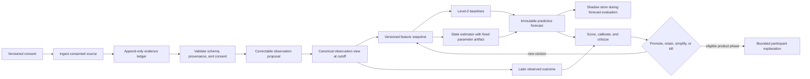

# Measurement and forecasting pipeline v0.2

- **Status:** Working proposal
- **Maturity:** Specified design; untested hypotheses
- **Date:** 2026-08-26
- **Scope:** Phase 0 scientific de-risking and the first synthetic tracer bullet
- **Version relation:** Substantively narrows the empirical starting point in the founding v0.1 model; v0.1 remains the historical baseline

## 1. Bottom line

Osanwe should build the first ML pipeline as an instrument for testing a narrow dynamic hypothesis, not as a six-dimensional model of a person and not as a recommendation engine.

The first end-to-end target is:

> Given evidence available at a fixed daily cutoff, forecast the participant's next-day answer to one directly observed felt-connection item, with a calibrated predictive distribution that is frozen before the answer arrives.

The first candidate dynamic state contains at most two operationalized, model-defined constructs:

1. current felt connection; and
2. current capacity or receptivity for social contact.

The two-state model advances only if it beats a one-state model and non-latent baselines prospectively. Conversation, relationship events, wearables, personalization, adaptive questions, and actions enter one at a time through predeclared experiments. A modality or model component that does not add decision-relevant value is removed.

This document specifies the research pipeline and its contracts. It does **not** select an application framework, database, model-serving stack, or wearable integration. Real participant implementation remains blocked by the readiness conditions in the [specification map](README.md#definition-of-ready-for-implementation). [ADR-0001](../decisions/0001-probabilistic-core-and-llm-boundary.md) remains unchanged.

### 1.1 What makes this more than a scorecard?

A scorecard and a learned model are both mathematics. The difference is not whether the formula looks sophisticated; it is how the parameters are obtained, what temporal assumptions are represented, whether uncertainty is propagated, and how the object is tested.

A fixed scorecard might compute:

\[
s_t=w_1(\text{check-in})+w_2(\text{sleep deviation})+w_3(\text{recent contact}),
\]

using hand-chosen weights and thresholds. It can be transparent and useful, so it remains a required baseline.

The proposed learned model instead specifies a probability distribution over observations and change through time, estimates a limited set of parameters from prior participant outcomes, and returns a predictive distribution rather than a single score. Its additional claims are:

- observations from different sources have different, empirically checked reliability;
- yesterday, today, and tomorrow are linked by an explicit temporal model;
- population information can be partially pooled with evidence about one participant;
- missing or conflicting evidence changes uncertainty rather than silently changing a score;
- the same model can issue a prospective distribution that can be falsified; and
- added structure survives only if it improves a locked evaluation or a later decision.

If a fixed scorecard, participant mean, or simple autoregression matches the learned model's calibration and decision value, Osanwe should use the simpler object. Complexity is not the product advantage. Verified incremental information and, later, causally supported decisions are.

### 1.2 What “adapts to the individual” means

There are two distinct update loops:

1. **Fast state inference:** with model parameters fixed, each new observation updates the participant's current belief state. This is inference, not training.
2. **Slow parameter learning:** after outcomes accumulate, an offline research process may update population parameters and a small set of participant-specific deviations. A candidate parameter version is promoted only after the locked evaluation plan passes.

For participant (i), a personal parameter begins with a population prior:

\[
\theta_i\sim\mathcal N(\theta_{population},\Sigma_{between}),
\]

and personal evidence updates it:

\[
p(\theta_i\mid D_i,D_{population})
\propto p(D_i\mid\theta_i)p(\theta_i\mid D_{population}).
\]

Early predictions therefore depend mostly on population evidence and carry wide uncertainty. As repeated, reliable outcomes arrive, the posterior may support a different baseline, volatility, persistence, or source reliability for that participant. It does not automatically learn every relationship between every input and outcome, and it does not rewrite itself after every conversation.

Initially eligible personal parameters are limited to:

- baseline level;
- short-term volatility;
- persistence of the primary observable trajectory; and
- reliability of a small number of separately consented sources.

Action effects, a full personal transition matrix, unrestricted feature weights, and neural representations are not eligible for online personalization in the first model.

## 2. Evidence-first development boundary and evidence ledger

The pipeline begins with a tractable proof of concept, changes interpretable variables before increasing complexity, measures both performance and system state, retains null results, and adds instrumentation only when a specific inference is blocked. These are project-level methodological constraints. They remain useful only when they produce clearer discriminating tests and cheaper, safer decisions.

| Material claim | Status | Origin | What would change the status |
|---|---|---|---|
| Evidence-first iteration is useful for organizing Osanwe's ML work. | specified | project methodology | It remains useful only if it produces clearer discriminating tests and cheaper, safer decisions. |
| A one- or two-state dynamic model is the right first learned candidate. | hypothesis | new proposal | Simulation, identifiability work, and prospective comparison against simpler baselines. |
| Narrative, graph history, or wearables add incremental forecast value beyond explicit check-ins and context. | hypothesis | new proposal | Prespecified temporal ablations and negative controls. |
| Hierarchical personalization adds value beyond a population model. | hypothesis | new proposal | Prospective comparison on future participant windows plus parameter-recovery evidence. |
| Information-selected questions reduce uncertainty or burden without harming measurement. | hypothesis | new proposal | Randomized fixed-question, selected-question, and ask-nothing comparison. |
| A participant-approved action improves a subsequent social outcome. | hypothesis | new proposal | A separately governed randomized design; forecast accuracy is insufficient. |
| The pipeline must preserve consent, provenance, corrections, uncertainty, and model lineage. | specified | new proposal | This is a product and research constraint, not an empirical performance claim. |

Unless a section says otherwise, normative contracts below have status **specified** and origin **new proposal**. Expected performance or human benefit remains a **hypothesis**.

## 3. The scientific object

### Observation

The pipeline observes consented, fallible records about the participant:

- explicit daily and weekly self-report;
- participant-recorded social interactions and relationship updates;
- context the participant supplies or separately permits;
- optional, participant-approved conversation excerpts proposed as structured evidence by a versioned extractor; and
- later, optional baseline-relative wearable features with device and algorithm lineage.

No observation is the latent state. Missing evidence is not negative evidence. A participant correction is authoritative about the record they supplied, but it does not turn a proposed latent construct into ground truth.

### Candidate predictive structures

The first experiment compares structures that make different predictions:

| Candidate | Predictive structure | Discriminating prediction |
|---|---|---|
| `M0: observed persistence` | Tomorrow resembles the last observation or recent average. | A latent model will not improve proper forecast score. |
| `M1: one dynamic connection state` | Repeated connection observations reflect a persistent but noisy process. | A one-state filter improves calibration or proper score over `M0`. |
| `M2: context-only change` | Recorded social events and context explain changes without a second latent dimension. | Context features add value; capacity state does not. |
| `M3: connection plus capacity` | Similar opportunities produce different connection outcomes when social capacity differs. | A second anchored state improves future forecasts and survives recovery tests. |
| `M4: added modality` | Narrative, graph, or wearable evidence contains unique signal not captured by anchors and context. | The modality improves prospective score by a predeclared practical margin and passes leakage controls. |

The latent variables are model-defined constructs under a versioned measurement model. They are not brain states, diagnoses, or hidden truths. Forecast-score differences among these candidates do not identify a psychological mechanism. Mechanism claims require a separate identification argument, such as a discriminating perturbation, and remain hypotheses until then.

### Intervention

The only intervention in the first pipeline is measurement: choose one reviewed question or choose to ask nothing. Social-action suggestions remain deterministic, participant-approved, and outside learned effect estimation until the causal-research gate in section 10 is passed.

### Primary endpoint

The first primary endpoint is explicitly named the **next-day daily felt-connection-item response**, measured with a fixed 1–7 item:

> How connected to other people did you feel today?

The item wording, response anchors, prompt window, time zone, allowed lateness, and missing-outcome rule must be fixed before evaluation. Accurate prediction of this response does not by itself validate a broader felt-connection construct. A construct claim requires multiple nonidentical indicators, response-process evidence, longitudinal measurement checks, and an external criterion not defined by the same item. Seven- and 14-day forecasts do not become primary targets until the one-day pipeline is calibrated and operationally sound.

### Estimand and intended-use registry

No human evaluation begins until one immutable evaluation plan defines:

```text
population and transition context
intended participant and intended use
unit of analysis                          participant-day for the first forecast
predictor eligibility and evidence cutoff
display and action policy during evaluation
outcome item, scale, window, and adjudication
forecast eligibility fixed at issuance
missing-outcome estimand and sensitivity analyses
primary score and participant-level aggregation
baseline selection rule and tuning budget
abstention fallback or cost
minimum practical forecast improvement
calibration, burden, privacy, dependence, and subgroup-harm tolerances
the concrete decision the forecast could eventually change
development, calibration, locked test, and replication datasets
```

The first forecast study runs in **shadow mode**: forecasts and model explanations are not shown before the target response is recorded. If an output is shown, display becomes an intervention and must be randomized or modeled explicitly.

## 4. Pipeline topology



There are three separate computational loops.

### 4.1 Evidence loop

Ingest, validate, propose, confirm or correct, and expose a time-indexed observation view. This loop never writes directly to latent state.

### 4.2 Inference loop

At a declared cutoff, combine a versioned observation view with a fixed model specification and fixed parameter artifact. Produce a belief snapshot and an immutable forecast. Online filtering is not parameter training.

### 4.3 Criticism loop

After the target outcome arrives, join it to the frozen forecast, calculate proper scores and coverage, inspect residuals and shift, and compare the candidate with every eligible baseline. Parameter fitting, posterior checks, model comparison, and promotion happen offline against versioned dataset snapshots.

Question selection is a fourth loop added only after the fixed measurement protocol is characterized. Causal action learning is a fifth, later research program; it must not share claim labels with forecasting.

### 4.4 Learning and adaptation loop

The initial runtime may update `BeliefSnapshot` objects after each accepted observation, but it uses a frozen `ParameterArtifact`. Parameter fitting occurs offline against a declared `DatasetSnapshot`:

```text
historical observations and outcomes
        -> fit candidate population and limited personal parameters
        -> run computation, recovery, predictive, and sensitivity checks
        -> evaluate on the locked plan
        -> promote or reject an immutable ParameterArtifact
        -> use the promoted artifact for later online belief updates
```

This version boundary prevents invisible self-modification. A new extractor, question, feature transform, model equation, prior, or parameter fit creates new lineage and reopens the relevant evaluation gate.

### 4.5 Deep modules and seams

The implementation should expose a small number of deep modules. Their interfaces are also the primary test surfaces.

| Module | Interface | Behaviour hidden behind the seam |
|---|---|---|
| `EvidenceLedger` | `append(event)` and `view(participant, cutoff, consent)` | bitemporal ordering, correction chains, revocation, provenance, and active-view construction |
| `FeatureBuilder` | `build(observation_view, feature_spec)` | windows, normalization, missingness indicators, graph summaries, and leakage prevention |
| `StateEstimator` | `update(previous_belief, feature_snapshot, parameter_artifact)` | transition, source likelihoods, uncertainty propagation, conflict handling, and abstention flags |
| `Forecaster` | `forecast(belief, target_spec)` | predictive integration over state and parameter uncertainty, fallback behaviour, and immutable record creation |
| `ModelTrainer` | `fit(dataset_snapshot, model_spec, evaluation_plan)` | parameter fitting, partial pooling, diagnostics, and candidate artifact construction |
| `ModelCritic` | `evaluate(forecasts, outcomes, evaluation_plan)` | proper scores, calibration, participant weighting, missingness sensitivity, ablations, shift checks, and promotion evidence |
| `DecisionPolicy` | `decide(belief, eligibility, constraints, policy_version)` | ask, act, or abstain; unavailable until the associated causal gate passes |

Storage vendors, numerical libraries, wearable vendors, and LLM providers are adapters at internal seams. The scientific contracts above should not change when one adapter is replaced.

## 5. Minimum event and artifact contracts

The storage implementation is undecided, but the logical contracts are required before real data collection.

### 5.1 Common event envelope

Every event has:

```text
event_id
participant_id                 pseudonymous, study-scoped
event_type
occurred_at                    when the participant says it happened
recorded_at                    when the source recorded it
ingested_at                    when Osanwe received it
schema_version
producer_type                  participant, device, extractor, system, researcher
producer_version
source_reference               pointer, not necessarily retained raw content
consent_grant_id
allowed_purpose
status                         proposed, confirmed, corrected, rejected, retracted
supersedes_event_id            never overwrite the earlier event
quality_flags
created_at
```

Event time, record time, and ingestion time are separate so late entries cannot leak into earlier forecasts. A correction creates a new event and a new derived view. It does not mutate the original evidence or the forecast that was actually issued.

### 5.2 Required event types

| Event | Minimum payload | Boundary |
|---|---|---|
| `ConsentGrant` / `ConsentRevocation` | source, purpose, fields, valid interval, retention-policy version | Every downstream view filters by consent valid at its evidence cutoff. Revocation triggers the separately specified deletion workflow. |
| `CheckInResponse` | question ID/version, response, displayed_at, answered_at, locale/time zone | A skipped prompt, undelivered prompt, and refused answer are distinct. |
| `ExpectedObservation` | target/question ID, scheduled window, delivered status, technical failure, quiet-period suppression, response status | Provides the denominator for response propensity and prevents absence from becoming a neutral value. |
| `WeeklyAnchorResponse` | instrument/item version, response, completion metadata | The interpretation and permitted use of the instrument must be documented. |
| `SocialInteractionEvent` | participant-reported time, mode, duration band, participant-experienced connection, pseudonymous tie/group ID | May describe the participant's experience; may not infer another person's beliefs, intent, or worth. |
| `ContextEvent` | reviewed context type, interval, participant confirmation | Physiology alone cannot create a psychological context label. |
| `NarrativeEvidenceProposal` | source-span reference, structured fields, extractor and prompt versions, field-level uncertainty | Before extractor calibration, unconfirmed proposals are research-only and cannot affect participant-facing state or forecasts. |
| `ObservationCorrection` | target event, field-level replacement or rejection, reason optional, actor | The prior event remains in the audit history; active views follow the correction chain. |
| `WearableFeatureObservation` | vendor-neutral feature, units, interval, coverage, device, firmware, vendor algorithm, transform version | Optional and baseline-relative; no psychological label is produced by the wearable. |
| `QuestionDecision` | eligible reviewed question IDs, ask-nothing option, utilities, burden budget, selected ID | The model chooses the information need; the LLM cannot invent an unrestricted probe. |
| `ActionDecision` / `ActionOutcome` | eligibility, alternatives, selection rule or probability, offer, acceptance, completion, burden, harm, proximal outcome | Logged now for provenance; causal interpretation is prohibited before the causal protocol. |

### 5.3 Immutable research artifacts

| Artifact | Required lineage |
|---|---|
| `DatasetSnapshot` | included event IDs, consent/deletion filter, evidence cutoff, schema versions, extraction versions, correction-view version |
| `FeatureSnapshot` | dataset snapshot, feature specification, transformations, missingness indicators, code revision |
| `ModelSpecification` | estimand, states, equations, priors, likelihoods, identifiability constraints, target and horizon |
| `ParameterArtifact` | model specification, training dataset, fitting procedure, diagnostics, seed, code and dependency revision |
| `BeliefSnapshot` | participant, cutoff, model and parameters, included evidence IDs, posterior summary, warnings, abstention state |
| `ForecastRecord` | issue time, target, horizon, full predictive distribution or quantiles, evidence cutoff, belief, model, parameters, action context |
| `OutcomeRecord` | target definition, observed time, value, source, observation quality, lateness and missingness status |
| `CriticismRecord` | forecast/outcome join, metric versions, baseline scores, coverage, residual and drift flags, decision |
| `EvaluationPlan` | estimand registry, primary metric, aggregation, missingness set, baselines, thresholds, splits, display policy, analysis revision, preregistration reference |

Every participant-facing inference must be traceable to a `ForecastRecord` or `BeliefSnapshot`, which in turn must be traceable to exact evidence and model lineage.

### 5.4 Narrative extraction gate

Narrative extraction is two different research questions:

1. **Extraction fidelity:** does the extractor produce the intended structured fields from approved text?
2. **Incremental forecast value:** after explicit check-ins and context, do those fields improve the declared future prediction enough to justify privacy and correction burden?

Fidelity is evaluated on a locked, participant-held-out corpus containing positive, negative, ambiguous, and out-of-scope examples. The reference set uses at least two blinded human annotators with adjudication and separately samples raw texts where the extractor proposed nothing so false negatives are measurable. Report field-level precision, recall, calibration, span/timestamp/entity error, abstention, critical false assertions, prohibited private-intent inferences, participant corrections, and prespecified language/group results.

Participant confirmation is a valuable observation but not an independent gold standard. Confirmed extraction, unconfirmed extraction, and direct participant self-report are analyzed separately. Every model, prompt, schema, or preprocessing change creates a new extractor version and reopens this gate.

## 6. The first model and its baselines

### 6.1 Level-0 baselines

Run these before a learned latent model:

1. population empirical distribution;
2. participant empirical ordinal distribution and participant mean;
3. last observation carried forward;
4. 7-day moving average and exponentially weighted moving average;
5. the fixed, auditable scorecard from section 1.1;
6. ordinal AR(1) with day-of-week and study-day terms;
7. autoregressive mixed-effects regression using explicit check-ins and declared context;
8. self-report-only one-state model; and
9. an LLM-only forecast receiving the same permitted information available at the same cutoff, when narrative is evaluated.

Each baseline emits a predictive distribution, not only a point. Candidates and comparators receive the same forecast instances, cutoffs, tuning budget, and permitted evidence for the comparison being made. The rule for selecting the strongest baseline is locked before the final evaluation set is opened.

### 6.2 Reference estimator for the synthetic tracer bullet

Use a fixed-parameter linear-Gaussian state-space model with one or two states and exact filtering. The hidden simulator parameters are known to the test harness. The estimator sees only simulated observations.

This reference estimator is **specified/simulated**, not empirically trained or validated. Its purposes are to prove:

- exact, deterministic replay under fixed inputs and seed;
- separation of process noise from source-specific measurement noise;
- no measurement update when an observation is missing;
- increased or redistributed uncertainty when sources disagree;
- immutable forecast and correction semantics; and
- recovery and abstention behavior under known failure cases.

### 6.3 First learned candidate for a future alpha

If the construct and privacy gates pass, fit offline a small hierarchical dynamic model:

\[
z_{i,t}=\mu_i+A(z_{i,t-1}-\mu_i)+C c_{i,t}+\epsilon_{i,t},
\qquad \epsilon_{i,t}\sim\mathcal N(0,Q),
\]

with source-specific observation models:

\[
y^{(m)}_{i,t}\sim p_m(H_m z_{i,t}, R_m).
\]

Start with a one-state local-level model. Add the second capacity state only if anchors fix its scale and orientation, simulation recovers it under expected missingness, and it improves prospective forecasts. Initially personalize only baseline, volatility, and selected source reliabilities through partial pooling. Do not fit a separate transition matrix for each participant.

Ordinal responses require an ordinal likelihood in the learned candidate. The Gaussian form remains a reference implementation and debugging oracle.

The measurement design must also constrain the tradeoff between process variance (Q) and source measurement variance (R_m). Acceptable strategies include repeated or multiple indicators, externally supported reliability information, or a preregistered sensitivity set with partially fixed parameters. Recovery under the model's own simulator is not sufficient identification evidence.

### 6.4 Runtime outputs

The inference layer returns separate objects for:

- current model-defined belief with intervals;
- directly observed evidence and recency;
- population versus participant-specific contribution;
- forecast distribution for a named observable target;
- source disagreement, missingness, shift, and out-of-support warnings;
- claim type: descriptive, predictive, correlational, causal, or unknown; and
- abstention reason.

It does not return a composite flourishing score, a diagnosis, or an assertion about another person's private state.

### 6.5 How one participant-day flows

Suppose a participant has separately permitted daily check-ins, relationship-event logging, narrative extraction, and baseline-relative sleep features.

1. The participant reports low connection and moderate social capacity. These are two explicit observations with known question versions.
2. A wearable adapter supplies a poor-sleep deviation with device, coverage, and transformation lineage. It is weak context evidence about capacity, not a direct observation of connection.
3. An LLM proposes that an approved excerpt describes a disappointing group interaction. Before the extractor gate passes, that proposal is either confirmed/corrected or remains research-only.
4. `EvidenceLedger.view` constructs the consent-valid observation set at the forecast cutoff.
5. `FeatureBuilder` creates the declared windows and missingness indicators without using later events.
6. `StateEstimator.update` combines the prior belief with each source likelihood. A reliable check-in can move the belief more than a noisy extractor; disagreement can widen uncertainty rather than averaging into false precision.
7. `Forecaster.forecast` integrates over uncertainty and stores a distribution for tomorrow's item response. During validation, the participant does not see it.
8. Tomorrow's independently scheduled outcome arrives. `ModelCritic` scores the frozen forecast and every baseline.
9. Repeated outcomes may later support a new offline estimate of the participant's baseline or source reliability. The promoted parameter version affects only subsequent forecasts and retains complete lineage.

The update is therefore not “the LLM changes a score.” Language becomes correctable evidence; a versioned probabilistic model determines how much that evidence changes a belief; future observations determine whether those updates improved forecasts.

### 6.6 Complexity ladder

| Level | Candidate | What it adds beyond the prior level | Promotion condition |
|---|---|---|---|
| 0 | Fixed scorecard, participant mean, last value, moving average | Transparent deterministic or empirical reference | Always retained as a comparator. |
| 1 | Ordinal autoregression or mixed-effects forecast | Learned persistence, calendar/context effects, population variation | Beats Level 0 prospectively with calibrated uncertainty. |
| 2 | One-state hierarchical state-space model | Separates a changing signal from declared source noise; online belief update | Measurement assumptions are identified enough to matter and locked-test value exceeds Level 1. |
| 3 | Second anchored capacity state | Represents a competing predictive structure such as depletion versus low connection | Multiple indicators recover it and it adds replicated decision-relevant value. |
| 4 | Narrative, graph, or wearable modality | Additional separately consented evidence | Each modality passes extractor/sensor validity, matched-day and deployed-effectiveness ablations, privacy, and burden gates. |
| 5 | Limited personal dynamics or drift model | More than baseline/volatility/reliability personalization | Future-window lift survives recovery, prior sensitivity, shift, and subgroup checks. |
| 6 | Switching, nonlinear, or neural residual model | Represents reproducible residual structure omitted by the simpler model | The diagnosed failure recurs, the gain replicates, and auditability, calibration, correction, and abstention do not degrade. |
| 7 | Causal action model and constrained policy | Estimates effects of eligible actions rather than associations | Randomized proximal effects, safety, later policy-level value, and rollback all pass. |

The expected stopping point is the lowest level that supports the intended decision. Level 2 is not inherently superior to Level 0, and Level 6 is not a roadmap obligation.

## 7. The synthetic tracer bullet

The first implementation begins only after this spec and its target contracts are reviewed. It uses no participant data.

### Synthetic protocol

Generate a versioned 84-day reference record with:

- one simulated participant;
- a known one- or two-state process;
- a daily connection item and a daily capacity item;
- a weekly anchor;
- participant-reported social-event and context observations;
- optional simulated narrative proposals and baseline-relative sleep features;
- planned missingness, one technical gap, one late event, one contradictory observation, one correction, and one distribution-shift episode; and
- a next-day connection outcome hidden until after each forecast cutoff.

The reference generator is independently implemented from the estimator. It is only the known-answer case. An adversarial generator suite must also include:

- no latent state, only ordinal persistence;
- nonlinear or regime-switching dynamics;
- irregular elapsed time;
- heavy-tailed noise and outliers;
- process-noise versus measurement-noise confounding;
- response-style drift and measurement reactivity;
- outcome-dependent missingness;
- unobserved shocks and delayed or incorrect timestamps;
- gradual and abrupt observation-model shift; and
- an added predictor that improves forecasts without corresponding to a separable latent construct.

### Demonstration sequence

1. Replay evidence through the consent and schema validator.
2. Show how an observation moves the posterior and how missingness changes uncertainty.
3. Issue and persist a next-day forecast from each baseline and candidate.
4. Reveal the simulated outcome and score all forecasts.
5. Correct one source event and derive a new posterior without changing the original event or forecast.
6. Present an out-of-support input and abstain.
7. Re-run from the same snapshot and reproduce artifact hashes and outputs.

### Acceptance criteria

- No event after `evidence_cutoff` affects a forecast.
- Consent-invalid evidence is absent from the feature and belief snapshots.
- Fixed input, model, parameters, and seed produce identical derived artifacts.
- The exact filter agrees with analytically solvable or independently calculated cases.
- A correction creates new derived lineage while the issued forecast remains immutable.
- Missing observations are not mean-filled or interpreted as a neutral state.
- The scripted shift widens uncertainty or triggers abstention under the declared rule.
- Shift detectors meet preregistered sensitivity and false-alarm tolerances across the adversarial suite.
- Identifiable regimes recover within declared tolerances; non-identifiable regimes produce warnings or abstention rather than confident state labels.
- Every forecast can be scored against every Level-0 baseline using the same outcome record.
- The demo labels the model and data **simulated** everywhere.

This tracer bullet validates pipeline semantics, not the social constructs, model family, or product benefit.

## 8. Experiments that earn complexity

Experiments are registered before opening their evaluation window. Each changes one interpretable variable where practical and preserves null results.

| Order | Question | Perturbation | Performance measure | State- or structure-sensitive measure | Negative control | Decision |
|---|---|---|---|---|---|---|
| 0 | Does the pipeline compute what it claims? | Known synthetic regimes, noise, gaps, correction, shift | Forecast score and replay equality | Parameter/state recovery, residuals, coverage | Impossible timestamp and consent-invalid event | Fix or stop; no real data. |
| 1 | Is the primary outcome measurable with acceptable burden? | Fixed daily item, multiple nonidentical indicators, weekly anchor, and randomized prompt-timing/reactivity check | Completion, within-person reliability, invariance, external criterion, burden distribution | Response process, source reliability, response propensity, correction rate | Prompt-delivery failure separated from nonresponse | Restrict claim to item prediction, revise, or kill construct protocol. |
| 2 | Do dynamics add value? | Level-0 versus one-state model | Prospective proper score, coverage, sharpness | Innovation autocorrelation and posterior sensitivity | Time-shuffled history | Retain simplest winner. |
| 3 | Is a second state distinguishable? | One-state versus connection-plus-capacity | Incremental prospective score | Recovery, loading orientation, posterior dependence, invariance | Rotated or weakly anchored simulator | Collapse if practically unidentified. |
| 4 | Does narrative add unique signal? | Check-ins/context versus plus confirmed narrative | Incremental score by horizon | Extractor field error, abstention, correction and subgroup error | Time-shuffled or irrelevant text | Remove from estimator if no safe lift. |
| 5 | Does graph history add unique signal? | Participant-observed event features on/off | Incremental score and tie-event forecast | Edge-feature stability and correction rate | Randomized pseudonymous edge assignment | Keep graph explicit; no GNN without lift. |
| 6 | Do wearables add unique signal? | Baseline-relative wearable feature group on/off | Incremental score | Device-phase residuals, coverage, vendor drift | Time-shuffled wearable series | Remove noncontributing features or modality. |
| 7 | Does personalization add value? | Population-only versus partial pooling | Future-window score for existing and cold-start participants | Person-parameter recovery and shrinkage | Random participant-ID permutation | Do not claim personalization without lift. |
| 8 | Is adaptive measurement worthwhile? | Fixed, selected, and ask-nothing arms while keeping primary outcome cadence invariant | Downstream score and questions avoided | Expected versus realized uncertainty reduction, response propensity, reactivity | Random eligible question | Retain only if intention-to-treat value exceeds burden/sensitivity. |

Forecast performance is the Phase 1 scientific gate, not the product endpoint. Product success requires randomized improvement in a participant-defined outcome outside the product, net of burden, privacy cost, inequity, and AI dependence. State- or structure-sensitive measurements diagnose why a candidate succeeded or failed. This pairing is a new Osanwe analogue of measuring both catalytic output and operando catalyst state; it is not evidence that human state is analogous to catalyst chemistry.

## 9. Evaluation protocol

### Freeze before seeing outcomes

For every prediction, persist the target, horizon, predictive distribution, evidence cutoff, model and parameter versions, feature snapshot, and policy/action context. Corrections may create a replay analysis, but never replace the forecast that was actually issued.

The initial forecast evaluation is shadow-mode. No forecast, belief, explanation, or action selected from that forecast is shown before the target response. If the display policy changes, the model is being evaluated under a different intervention regime and needs a new evaluation plan.

### Separate development from evaluation

- Use rolling-origin or forward-chaining splits only inside development.
- Use a development cohort/window for fitting and model selection, a separate calibration/threshold window, and a never-opened locked test window.
- After the locked test, require prospective replication in a later cohort, site, season, or transition phase before a transport claim.
- Separate leave-participants-out cold-start evaluation from existing-participant future-window personalization.
- Fit transforms and parameters only on evidence available in the training window.
- Score every eligible forecast, including abstentions and periods with modality loss.
- Weight the primary aggregation by participant so heavy responders cannot dominate; estimate uncertainty with participant clustering.
- Use a prespecified gatekeeping order for model and modality comparisons rather than repeatedly selecting on the locked test.
- Report results by horizon, study phase, modality availability, and prespecified participant groups where consent and sample size permit.

### Primary metrics

- ordinal or continuous ranked probability score, as appropriate;
- log score where numerically and scientifically appropriate;
- 50%, 80%, and 95% interval coverage and width;
- calibration plots or grouped calibration summaries;
- score difference from the strongest Level-0 baseline;
- abstention rate and error conditional on abstention status;
- participant burden, correction rate, privacy regret, and AI-dependence countermetrics.

Point-error metrics are secondary. Sharp intervals count as useful only when coverage is calibrated.

The evaluation plan names one primary score and its minimum practical improvement. Calibration fitting occurs before the locked test. An abstention receives a fixed fallback distribution or preregistered utility cost and remains in the denominator; selective prediction cannot improve its score merely by refusing hard cases.

### Missing outcomes

Forecast eligibility is fixed when the forecast is issued, not after learning whether the participant answered. The response indicator is recorded and evaluated separately. Primary results report:

- participant-weighted score among observed outcomes with the exact denominator;
- response probability by prior state, burden, phase, and policy;
- bounds or sensitivity analyses under prespecified plausible MAR and MNAR models; and
- whether the promotion conclusion changes under those assumptions.

No model advances solely on a complete-case analysis. Adaptive measurement keeps an independently scheduled primary outcome cadence so the question policy cannot improve its apparent performance by removing difficult labels.

### Model criticism

- prior and posterior predictive checks;
- simulation-based calibration and parameter-recovery grids;
- one-step innovation trend and autocorrelation;
- cross-modal disagreement and missing-streak replication;
- sensitivity to priors, likelihood tails, timing, and plausible missingness mechanisms;
- device, extractor, schema, question-wording, and life-phase shift checks; and
- modality ablations plus irrelevant/time-shuffled controls.

Optional modalities require two analyses: conditional efficacy on identical participant-days where the modality is available, and deployed effectiveness including refusal, outage, correction burden, privacy cost, and abstention.

The [foundational modeling note](../research/foundational-modeling-and-criticism.md) gives the statistical rationale and primary sources for prequential evaluation, proper scoring, simulation-based calibration, posterior predictive checks, and model criticism.

### What each evidence layer can establish

| Evidence layer | Claim it can support | Claim it cannot support |
|---|---|---|
| Adversarial synthetic tracer | The software implements cutoff, consent, replay, correction, filtering, scoring, and declared failure behaviour. | Human measurement, real-data calibration, personalization, or benefit. |
| Instrument and measurement study | The protocol is usable and the declared item or construct has specified reliability, invariance, response-process, reactivity, and missingness properties under the study conditions. | Useful forecasting, mechanism, or product benefit. |
| Locked prospective forecast study | The model predicts the exact named outcome better than the exact baselines in the exact population and policy regime. | Construct truth, causal mechanism, action effect, transport, or flourishing improvement. |
| Modality and personalization ablations | A source or partial-pooling parameterization adds incremental predictive value under declared consent and availability patterns. | Semantic truth, causal necessity, or that the privacy/burden tradeoff is worthwhile. |
| Randomized adaptive measurement | The question policy changes burden, response availability, or downstream forecast performance. | A social action helps. |
| Micro-randomized action trial | Offering an eligible action has a proximal average causal effect under that protocol. | Durable benefit, individual optimality, or whole-product value. |
| Policy-level randomized trial | The deployed eligible policy improves a participant-defined external outcome versus controls, net of harms and costs. | Universal transportability or privileged access to private psychological truth. |

## 10. Promotion rules

Before any prospective study, the protocol must replace `delta` and `epsilon` below with numeric minimum-practical-effect and tolerance values justified by a decision/value analysis, simulation, sample size, and participant input. They cannot be chosen for statistical convenience or after results are visible.

| Gate | Advance only if | Simplify, hold, or kill if |
|---|---|---|
| Intended use | The estimand registry, target population, concrete downstream decision, display policy, primary score, missingness plan, thresholds, and datasets are locked. | Any field remains open when the evaluation set is accessed. |
| Technical integrity | All tracer-bullet acceptance criteria pass. | Leakage, nonreproducibility, broken correction/deletion semantics, or unsafe extrapolation remains. |
| Measurement | Multiple indicators satisfy preregistered within-person reliability, response-process, invariance, external-criterion, reactivity, and missingness-sensitivity rules. | Restrict the claim to prediction of the named item response, or kill the broader construct claim. |
| Forecast | On the locked test, the lower uncertainty bound for participant-weighted improvement over the strongest same-information baseline exceeds `delta_forecast`, calibration remains within `epsilon_calibration`, and replication passes. | No stable practical lift, systematic undercoverage, conclusion reversal under missingness sensitivity, or benefit confined to a post hoc slice. |
| Modality | Incremental value exceeds `delta_modality` without unacceptable error, burden, inequity, or privacy cost. | Null lift, leakage, version fragility, uncorrectable error, or privacy cost dominates. Remove it from the estimator. |
| Personalization | Partial pooling improves future-window score over the population model and personal parameters are recoverable under expected data density. | Individual effects are prior-dominated, unstable, or add no forecast value. Do not claim learning the person. |
| Adaptive measurement | Intention-to-treat comparison shows selected questions preserve or improve the independent primary outcome while reducing burden by `delta_burden`; realized information gain tracks external predictive value. | No downstream value, nonresponse/reactivity rises, sensitivity cost is excessive, or ask-nothing performs as well. |
| Causal research | Outcomes are reliable; eligible actions, quiet periods, adverse-event handling, randomization probabilities, stopping rules, and independent review are specified. | Measurement or forecasting is inadequate, actions are not safely repeatable, or monitoring duties cannot be met. |
| Adaptive policy | Randomized evidence shows a practically useful proximal effect, the reward includes burden and AI-dependence penalties, and constrained simulation plus rollback pass. | No replicated effect, heterogeneous harm, unsafe exploration, reward gaming, or dependence increases. |
| Product value | A policy-level randomized study beats measurement-only and generic-guidance controls on a participant-defined outcome outside the product, net of burden, privacy regret, inequity, and AI dependence. | Only in-product metrics or forecast scores improve, benefit does not replicate, or human contact is displaced. |

Passing a later gate does not repair failure at an earlier one. Forecast accuracy does not validate a construct, identify a mechanism, or establish an action effect.

For the instrument-only alpha, accepted records must pass required-field validation, consent and revocation test cases must be enforced without exception, audited records must replay deterministically, and median daily check-in burden should remain at or below the product's proposed 60-second budget. The evaluation must also report upper-tail burden, attrition, correction fatigue, and differences by prespecified participant groups. These are engineering and feasibility gates, not evidence that the model is scientifically valid.

## 11. Safety, privacy, and abstention

### Hard boundaries

- No diagnosis, crisis inference by the generative model, or clinical claim.
- No inference about another person's private beliefs or intentions.
- No autonomous communication or social action.
- No unrestricted question generation, online reinforcement learning, or engagement objective.
- No raw conversation, contact, location, calendar, or wearable collection without source-specific, revocable consent and a declared purpose.
- No participant-facing inference from LLM extraction that is uncalibrated **or** insufficiently confirmed under the declared policy.
- No silent model, extractor, prompt, feature, device-algorithm, or policy update.

High-risk mental-health handling, if offered at all, is a separate deterministic and governed protocol. It is not an output of this pipeline.

Before human collection, the evaluation plan must set quantitative review and stop boundaries for adverse events, privacy regret, response burden including its upper tail, correction fatigue, AI dependence, displaced human contact, subgroup error, and recruitment coercion. A threshold crossing pauses the associated study or output even if forecast performance improves.

### Required abstention conditions

Abstain or fall back to a non-personalized descriptive view when:

- required anchors are stale or absent;
- evidence sources materially conflict;
- an extractor, device, schema, or question version is unsupported;
- the feature snapshot is outside the model's declared support;
- calibration monitoring crosses its stop boundary;
- consent or deletion status is unresolved; or
- the output would require a causal or interpersonal claim the evidence cannot support.

An abstention names the technical reason without inventing a psychological explanation.

### Deletion and correction

The privacy design must specify how revocation removes raw and derived participant data, invalidates affected artifacts, and preserves only the minimum lawful audit tombstone. Until that design and threat model are accepted, the pipeline is limited to synthetic data.

## 12. Iteration plan

### Iteration 0: close the design blockers

1. Select one transition population and recurrent use case.
2. Review the daily target item, capacity item, weekly anchor, response windows, and burden budget with measurement expertise and participant input.
3. Accept the common event envelope, correction semantics, consent scopes, and prohibited relationship inferences.
4. Write the privacy threat model, raw-data policy, deletion graph, export contract, and research/product consent boundary.
5. Complete the estimand registry, including the concrete decision the prediction could later change.
6. Preregister the baseline suite, forecast cutoff, development/calibration/locked-test sequence, missingness set, display policy, primary metric, abstention cost, and numeric promotion thresholds.

### Iteration 1: synthetic tracer bullet

Implement only the contracts and acceptance criteria in section 7. Use independently implemented reference and adversarial generators, Level-0 baselines, one exact reference filter, an immutable artifact ledger, and a criticism report. Do not build a broad product surface.

### Iteration 2: instrument-only alpha

Begin with cognitive interviews and response-process work, then use 10–20 consented participants to test collection, correction, burden, observability, measurement reactivity, response propensity, deletion/export, shadow forecasts, and extractor-workflow feasibility. Treat this as feasibility evidence, not efficacy, full extractor validation, construct validation, or population-model validation. Unconfirmed narrative remains research-only.

### Iteration 3: prospective forecasting study

Choose sample size through simulation for the exact hierarchical model and minimum practical forecast improvement. The simulation includes participant clustering, autocorrelation, attrition, missing-not-at-random sensitivity, modality availability, calibration precision, multiplicity, subgroup precision, and the locked stopping rule. Evaluate the one-state model first, then run the ordered ablations in section 8 without reusing the locked test for model selection. Require prospective replication before a transport claim. Promote 7- and 14-day targets only if their outcome definitions and cadence are adequate.

### Iteration 4: adaptive measurement

Randomize reviewed fixed, selected, and ask-nothing question policies under a burden budget. Advance only if selected measurement improves decision-relevant uncertainty or preserves forecasts with fewer prompts.

### Iteration 5: causal action research

Only after the earlier gates pass, specify a micro-randomized protocol for a small set of participant-approved, low-risk, reversible options and no-action controls. Estimate proximal excursion effects before considering individual action ranking or a contextual bandit.

### Iteration 6: product-value evaluation

Randomize the complete eligible policy against measurement-only and generic-guidance controls. The primary endpoint is participant-defined and outside the product. Claim product value only if intention-to-treat benefit exceeds the preregistered practical threshold, harm and dependence remain below their upper bounds, human contact is not displaced, and the result replicates.

## 13. Unresolved decisions

This pipeline cannot responsibly move to real participant data until these are resolved:

1. first participant population and transition context;
2. primary use case and participant-defined success;
3. exact target item, anchors, cadence, and burden budget;
4. whether the first candidate has one state or two after simulation;
5. event identity and relationship-graph semantics;
6. privacy architecture, raw-text policy, deletion/export, and consent separation;
7. extractor evaluation set and acceptance thresholds;
8. numeric minimum practical forecast, calibration, modality, and burden thresholds; and
9. governance owner for adverse events, drift review, and model promotion;
10. the shadow-display, later disclosure, and explanation-evaluation policies;
11. participant-level weighting, missingness sensitivity, and abstention cost; and
12. external replication setting and population-model deletion/unlearning policy.

The immediate decision remains the same as in [open questions](open-questions.md): write and accept the one-page target-participant and use-case specification. That choice determines the event vocabulary, outcomes, cadence, safety posture, and study protocol.

## 14. Source trail

- [ADR-0001: Keep state estimation outside the LLM](../decisions/0001-probabilistic-core-and-llm-boundary.md)
- [Product bridge v0.1](product-bridge-v0.1.md)
- [Personalized Social Flourishing Model v0.1](personalized-social-flourishing-model-v0.1.md)
- [Foundational modeling and criticism for Osanwe](../research/foundational-modeling-and-criticism.md)
- [Personalized longitudinal state estimation and intervention learning](../research/personalized-longitudinal-state-estimation.md)
- [TRIPOD+AI reporting guidance](https://doi.org/10.1136/bmj-2023-078378)
- [PROBAST+AI quality and risk-of-bias guidance](https://doi.org/10.1136/bmj-2024-082505)
- [Micro-randomized trial design for proximal intervention effects](https://pmc.ncbi.nlm.nih.gov/articles/PMC4732571/)
